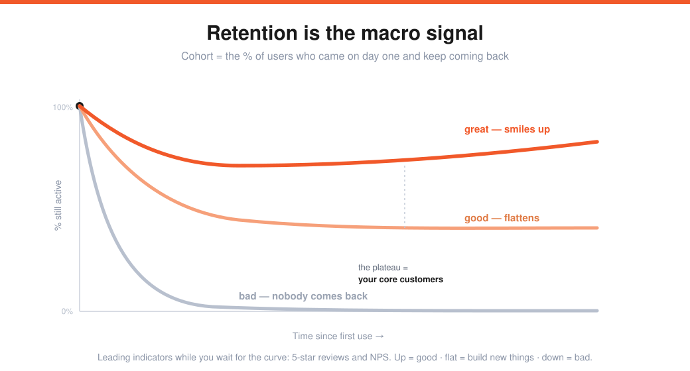
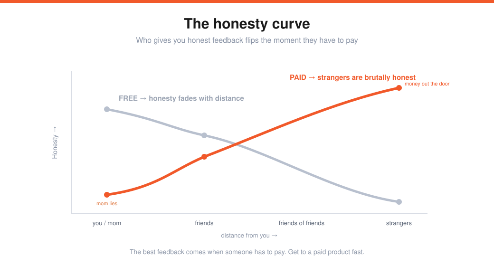

# Adora Cheung — Building Product, Talking to Users & Growing (Lecture 4)

> Source: Stanford CS183B, Lecture 4 (Oct 10, 2014). Adora Cheung (co-founder, Homejoy).
> Transcript: https://genius.com/Adora-cheung-lecture-4-building-product-talking-to-users-and-growing-annotated
> Captured: 2026-05-31
> The tactical companion to [[01-four-pillars-sam-altman]]'s "build something users love."

Going from **zero users to many users** — most of it learned from failure. Homejoy's current concept was the **13th idea** Adora fully built and tried to grow. Caveats: take advice as *directional*; every business is different. And give yourself **compressed, immersive time** — one or two full days beats two scattered hours a day (startups context-switch like coding).

---

## The novice mistake (the vicious cycle)
> "I have a great idea, I won't tell anyone, I'll build-build-build, launch on TechCrunch, and get lots of users."

What actually happens: no early feedback → people visit but **nobody sticks** → you buy some users → they whittle away → you give up. Adora did exactly this *inside YC* and never even launched.

---

## Start from the problem, not the product
- State the problem in **one sentence.**
- Is it a problem **you** have? Are you **passionate** about it? Do **others** have it? Verify by **talking to people.**
- ⚠️ **Pathjoy cautionary tale:** Adora and her brother built a platform for life coaches & therapists to "make people happier" — but they'd never use life coaches themselves. Not their problem, no passion. ~A year wasted. Decide this at *T=0*, before building.

## Immerse in the industry — become a cog
Counterintuitive: to disrupt an industry, first *join* it for a month or two and learn every bit and piece — that's where you see the inefficiencies.

- **Homejoy:** they became cleaners, bought how-to-clean books (basketball: you can't learn it from a book), then **got a job at a cleaning company.** Adora learned to clean *and* learned why local cleaning companies can't scale — old-school, inefficient booking and scheduling.
- If there's a service element, **do the service yourself** (restaurant → be a waiter; painting → be a painter).
- **Be obsessive:** list every competitor big and small, read every search result 1→1000, read their S-1s, quarterly financials, sit on earnings calls. Mostly noise, occasional gold. **Become the expert** so people trust you.

## Before any code
1. **Identify a customer segment.** You want everyone eventually, but start by cornering a specific base you can optimize for (teenage girls vs. soccer moms) — it's about **focus.**
2. **Storyboard the whole user experience** — not just the site: how they hear about you (ad / word-of-mouth) → land → what the copy says → sign up → purchase → what they get → leave a review. Visualize the *perfect* flow, put it on paper, then code.

---

## Build the MVP — emphasis on *viable*
Minimum **viable** product = the smallest feature set that *actually solves* the problem. People skip "viable" and ship a flat experience.

**Nail the one-liner (product positioning).** You must say what it does in one sentence.
> Homejoy started as "an online platform for home services, you start with cleaning and you can choose…" — paragraphs; users got bored. Changed to **"get your place cleaned for $20 an hour"** → everyone got it, users came in. Lead with **functional** benefits (emotional benefits come later, when building a brand).

## Get your first users (do things that don't scale)
- Start with who you know: you, cofounder, mom & dad, friends, coworkers.
- Then: online communities (**Show HN** for dev tools), local community mailing lists (parents).
- **Homejoy's hustle:** parents in Milwaukee, founders in Mountain View — dead end. So they worked Castro St. street fairs, **froze water bottles**, handed out cold water on a hot day, and guilt-tripped people into booking. The signal that it was real: **they didn't cancel.** (Another startup pulled people out of line at the post office.) Go where people show up — conversion is low, but it gets you 0→1→3→4.

## Talk to users — get out from your desk
- Give an inbound channel (a phone number — with **voicemail** so you're not always answering). But really: **go out and talk to them.** It's a slog; it's the best feedback you'll get.
- **Surveys** only capture people who *love* or *hate* you — never the middle. To reach the middle, **meet them and make it a conversation,** not an inquisition/laboratory. Get them comfortable and honest — take them for coffee or drinks.

## Track retention (the macro metric)
- **Customer retention** is the truest macro signal: who came today, who's still here next month.
- It's slow to collect (months), so use **leading indicators**: 5-star **reviews/ratings** and **NPS** (0–10, "how likely to recommend?").
- As you ship features: reviews + retention **up** = good; **down** = bad; **flat** = go build new things.

## The honesty curve
Feedback honesty changes with how far someone is from you — and **flips when the product is paid.**

- **Free product:** your mom is proud (honest only so-so), friends are fairly honest, random people don't care → honesty *decreases* with distance.
- **Paid product:** your mom lies and says it's great, friends help, but **random strangers are brutally honest** — it's money out the door → honesty *increases* with distance.

> The best feedback comes when **someone has to pay.** Don't necessarily charge on day one, but get to a paid product *fast.*

---

## Build for the stage you're in
- Optimize for the **next** stage of growth (10 → 100 users), not for 10 million.
- **Don't automate too early — do it manually yourself** to learn what to build. Homejoy vetted cleaners by phone + in-person questions + a test clean (3–5% acceptance), *learned which questions predicted good performers*, then built the online application. Automating first would've killed iteration.
- **"Temporary brokenness is much better than permanent paralysis."** Perfection is irrelevant now; build the **generic/core case**, ignore edge cases (their volume only grows later).
- ⚠️ **Beware the Frankenstein approach:** users ask for features; don't just build them all. **Get to the bottom of *why* they're asking** — the request usually masks a real underlying problem. Solve that, don't pile on features that hide it.

## Launch — don't stay stealth
Imitation is cheaper than innovation; someone will fast-follow whenever you launch. Staying stealth out of paranoia just costs you the feedback you need. Unless you need tens of millions just to start — **launch.**

---

## Growth

Early on, growth is **one person**, not a team. Focus — don't run five strategies at once.

| Habit | Detail |
|---|---|
| **One channel at a time** | Execute fully on a single channel for a week. Works → ride it until it caps out. Doesn't → move on. (You learn more from one focused week than ⅓-effort over three.) |
| **Always iterate** | Working channels need constant tuning — FB/Google ads and the environments you don't control change. Build a playbook. |
| **Revisit dead channels** | Drop a failed channel, but come back later. (Homejoy couldn't afford Google ads early — national firms outbid them — but later made more per job, worth revisiting.) |
| **Be creative** | If growth were easy and bland, everyone would grow. Find the thing no one else is doing and do it to the extreme. |

### The three types of growth
| Type | What it is | What it needs | How to measure |
|---|---|---|---|
| **Sticky** | Existing users come back / buy more | A good — ideally **addictive** — experience | CLV + retention cohort analysis |
| **Viral** | Users tell their friends | A *really* good experience **+** good referral mechanics | viral coefficient / referral conversion |
| **Paid** | Spend money to acquire users | **CLV > CAC** | CAC = CPC ÷ conversion; profit = CLV − CAC |

**Referral mechanics (viral) have three parts:** (1) **touch points** — surface the referral link when the user is *highly engaged* (after sustained use; in-home leave-behinds); (2) **program mechanics** — e.g. "$10 for $10," test variants; (3) **optimize the invited friend's signup conversion flow.**

### Sustainability & payback
- Sustainable growth = **not a leaky bucket** — money in earns a return.
- **Payback time** is critical. A customer worth $300 over 12 months ($100 in month 1) — if you pay $200 to acquire them, you're **in the hole until month 12.** Something goes wrong → you run out of money (on credit cards → bankruptcy).
- **Safe payback ≈ 3 months. Risk-loving ≈ 12 months. Beyond 12 months = unsafe.**
- Break CLV/CAC down by **cohort/segment** — Nashville vs. Czechoslovakia CLV for a country-music marketplace differ wildly; don't average them together.

---

## The art of pivoting
**Move on when:** you can't grow despite building features and talking to users (nothing sticks), **or** the unit economics simply don't work.

- Growth is the trickiest signal (some ideas stick for years then take off), so **set a growth plan up front** — optimistic but realistic (week 1: 1 user, week 2: 2, doubling). Build whatever it takes to hit each week's number.
- Manual user-finding works up to ~**100 users/week**; past that you need real growth strategies.
- If you're fully executing and working hard but see **3–4 weeks of flat or backward growth**, consider a pivot — early startups should *always* be growing.
- Real growth is **lumpy.** In a lull, **don't stop** — keep working hard for 2–3 weeks and the trend recovers.

## Q&A — getting users to switch
There's always a **switchover cost.** Don't list 50 small advantages — find the **one or two clear differentiators** and the *moment* you're obviously better. (Homejoy: someone whose regular cleaner is unavailable after a party uses Homejoy's **next-day availability** — then discovers the small wins: online payment, easy rescheduling.)

---

## My action items
- [ ] **Problem:** One sentence. Is it mine, am I passionate, do others have it — verified by talking to real people?
- [ ] **Immerse:** Have I done the work myself / become an expert in the industry's inefficiencies?
- [ ] **One-liner:** Can a stranger understand what I do in one sentence?
- [ ] **Feedback:** Am I getting out from my desk — and getting *paid*, honest feedback?
- [ ] **Retention:** Is my cohort curve flattening into a core, and trending up as I ship?
- [ ] **Growth:** One channel, fully executed. Is CLV > CAC with a payback under ~3 months?
