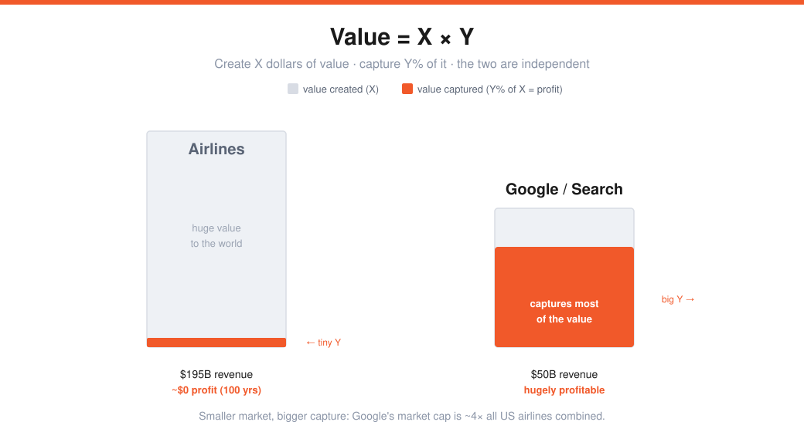
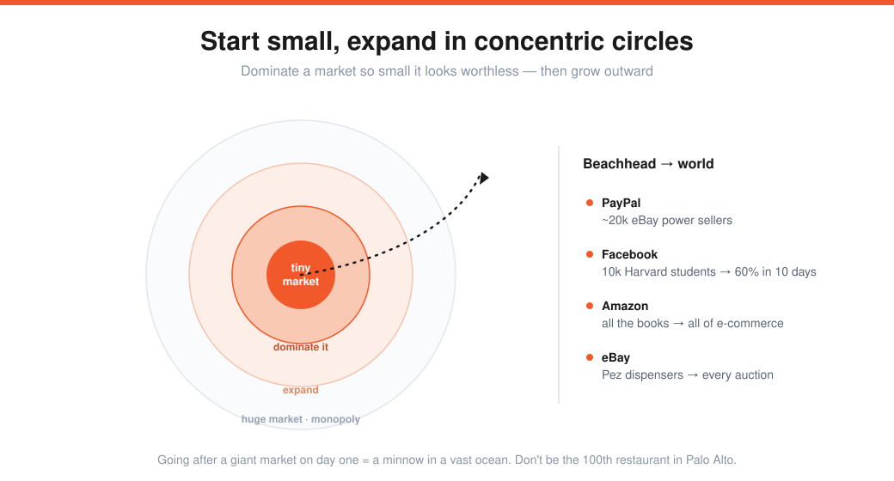

# Peter Thiel — Business Strategy & Monopoly Theory (Lecture 5)

> Source: Stanford CS183B, Lecture 5 (Oct 7, 2014). Peter Thiel (co-founder of PayPal, Palantir, Founders Fund).
> Transcript: https://genius.com/Peter-thiel-lecture-5-business-strategy-and-monopoly-theory-annotated
> Reading: *Zero to One*, ch. 3–5. The strategic frame around [[01-four-pillars-sam-altman]]'s "monopoly via a small market."

One *idée fixe*: **if you're a founder, always aim for monopoly and always avoid competition. Competition is for losers.**

---

## Value = X × Y
A valuable company does two independent things:
1. It **creates X dollars of value** for the world.
2. It **captures Y%** of X.

> The mistake everyone makes: **X and Y are completely independent.** X can be huge while Y is ~0.

**Airlines vs. Google** (2012): US airlines did **$195B** in domestic revenue; Google did **~$50B**. Air travel feels more important — but airlines' cumulative profit over their **entire 100-year history is roughly zero** (make money, go bankrupt, recapitalize, repeat). Their combined market cap is ~**¼ of Google's**. Search is far smaller than air travel, yet far more valuable. Different values of X and Y.

---

## There are exactly two kinds of business
A binary, extreme view: companies are either **perfectly competitive** or **monopolies** — "shockingly little in between."

- **Perfect competition:** capital gets competed away; you don't make money. *"Capital and competition are antonyms."*
- **Monopoly:** stable, long-term, well-capitalized; a *creative* monopoly is a sign you built something genuinely new and valuable.

### The lies people tell (why the dichotomy is hidden)
| | Real market | The lie | Rhetoric |
|---|---|---|---|
| **Monopolist** | small & dominated | "we're in a *huge*, competitive market" (avoid regulation) | the **union** of many markets |
| **Non-monopolist** | big & brutal | "we're *unique*, barely any competition" (attract capital) | the **intersection** of narrow markets |

- **Non-monopolist lie:** "the only British-food restaurant in Palo Alto" — a fictitiously narrow market. *"The something of somewhere is mostly the nothing of nowhere — the Stanford of North Dakota."*
- **Monopolist lie:** Google (with ~66% search share) calls itself an **advertising** company (3.5% of a ~$500B global market) or a **technology** company (~$1T market, "competing with everyone") — anything but a search monopoly.
- **Tell:** a pitch that's an *intersection of buzzwords* (sharing + mobile + social) is usually a bad sign.

---

## How to build a monopoly: start small, expand concentrically
> Counterintuitive: **go after small markets.** Start with a tiny market, take over the *whole* thing, then expand in concentric circles.

Going after a **giant market on day one** is evidence you defined the category wrong — you'll be "a minnow in a vast ocean" with too many competitors. The successful path:

| Company | Beachhead | Expansion |
|---|---|---|
| Amazon | all the books, online | → all e-commerce |
| eBay | Pez dispensers → Beanie Babies | → all online auctions |
| PayPal | ~20k eBay power sellers (looked like a *terrible* market) | 25–30% penetration in 2–3 months → from there |
| Facebook | 10k Harvard students (0→**60% in 10 days**) | → the world |

These look worthless to business-school analysis precisely *because* they start so small. The value came from growing them **concentrically**. (Counter-example: clean-tech, ~2005–2008 — every deck opened with a market "measured in hundreds of billions of trillions." Don't be the 4th pet-food site, the 10th solar company, the 100th restaurant.)

---

## The four characteristics of a monopoly
No single formula — *"all happy companies are different"* (they do something unique); all unhappy companies are alike (they failed to escape competition).

1. **Proprietary technology** — ~**10x better** than the next best thing on a key dimension. (Amazon: 10x the books. PayPal: 10x faster than checks' 7–10 days. iPhone: the first smartphone that *worked*.) Something brand-new = an "infinite" improvement.
2. **Network effects** — hard to start (why is it valuable to the *first* user?), but get **more robust as the network scales.**
3. **Economies of scale** — high fixed cost, low marginal cost. Software's marginal cost ≈ **0**, so it scales beautifully.
4. **Branding** — real value, but hard; Thiel won't invest in *pure*-branding plays.

---

## Durability: be the LAST mover, not the first
A monopoly for a *moment* isn't enough — it has to **last.**

> Better than "first mover" is **last mover**: the last great company in a category. Microsoft (last OS for decades), Google (last search), Facebook (last social network — *if* it lasts).

**Most of the value is far in the future.** A DCF of PayPal in March 2001 (27 months in, 100% annual growth, 30% discount rate) put **~75% of the company's value in cash flows from 2011 and beyond.** For tech companies generally, **75–85% of value sits ~10+ years out.**

> "We overvalue growth rates and undervalue durability." Growth is measurable now; durability — *will this still lead in 10–20 years?* — is qualitative and dominates the value equation.

Each characteristic has a **time dimension.** Networks strengthen over time. Proprietary tech is tricky — you can be *superseded* (1980s disk drives: relentless innovation, great for consumers, **nobody made money**). Capablanca: *"You must begin by studying the end game."*

---

## The history of innovation, read through X × Y
Because X and Y are independent, **most great innovations created value but captured ~0% of it.**

- **Science: Y ≈ 0% across the board.** Einstein invents relativity → not even a millionaire. Railroads → mostly bankrupt (too much competition). Wright brothers → no money.
- **Textile mills (1780–1850):** 5–7%/yr efficiency gains for 60–70 years, all competed away; wealth stayed with the landed aristocracy.

Only **two categories** in 250 years where people made something new *and* captured the value:
1. **Vertically integrated complex monopolies** (2nd industrial revolution) — Ford, Standard Oil. Require complex coordination of many pieces; capital-intensive; under-explored today. **Tesla** (integrated distribution) and **SpaceX** (pulled subcontractors in-house) had *no single 10x breakthrough* — their edge was masterful vertical integration.
2. **Software** — huge economies of scale, ~0 marginal cost, and **fast adoption** (bits, not atoms). Fast adoption is critical: slow adoption gives competitors time to enter.

**Watch the rationalizations** that hide the X/Y structure: "scientists aren't in it for money" (maybe just cover for Y=0%); "software folks make fortunes, so it must be the most valuable thing" (Twitter worth more than Einstein? — no, X and Y are independent).

---

## Competition is for losers — the psychology
The blind spot is **psychological**, not just intellectual. Humans are imitative — *"ape"* meant both *primate* and *imitate* in Shakespeare's day. We treat **competition as validation.**

- Lots of people chasing the same thing is often **proof of insanity, not value** (20,000 move to LA to be movie stars; ~20 make it).
- Kissinger on Harvard faculty: *"The battles were so ferocious because the stakes were so small."* When real differences are tiny, you fight viciously to maintain imaginary ones.
- Thiel's own path: hypertracked → Stanford Law → a NY firm where *"from the outside everybody wanted in, and on the inside everybody wanted to leave."* He left after **7 months and 3 days** — "escape from Alcatraz: go out the front door and don't come back."

> Competition makes you better at the thing you're competing at — at the price of no longer asking what's truly valuable. **"Don't always go through the tiny door everyone's rushing through; go around the corner and through the vast gate nobody is taking."**

---

## Sharp Q&A nuggets
- **Monopoly or not?** Ignore the narrative — ask *"what is the actual, objective market?"* People are powerfully incentivized to distort it.
- **Google** has all four characteristics (ad network effects, PageRank, scale, brand) — maybe "3.5 of 4" now.
- **Lean startups?** Thiel is skeptical. Great companies made a **quantum improvement**, didn't run massive customer surveys, and weren't easily deterred by what others said. We over-index on iteration vs. a "virtual ESP link with the public" — figuring it out yourself.
- **Risk:** complicated. A "low-risk" track (law) can be *high-risk* for the risk of **not doing anything meaningful with your life.**
- **Last mover implies competition?** The monopoly was usually a big **first mover on one key dimension** (Google → PageRank; Facebook → *real identity*), even if others came before in name.
- **It afflicts all of us.** Competition-as-validation isn't just "those people at business school / Wall Street." Like advertising, we assume it works only on others — it works on us. **Never underestimate the problem.**

---

## My action items
- [ ] **X vs Y:** How much value do I create (X), and what % can I actually capture (Y)? Am I in a structurally profitable market or a competitive one?
- [ ] **Honest market:** What's my *objective* market — not the flattering narrative? Am I telling myself a union or intersection lie?
- [ ] **Beachhead:** What's the small market I can take to ~100% and expand from concentrically?
- [ ] **Moat:** Which of the four (10x tech / network effects / scale / brand) do I have — and will it *last* 10+ years?
- [ ] **Psychology:** Am I doing this because it's truly valuable, or because everyone else is rushing the same door?
