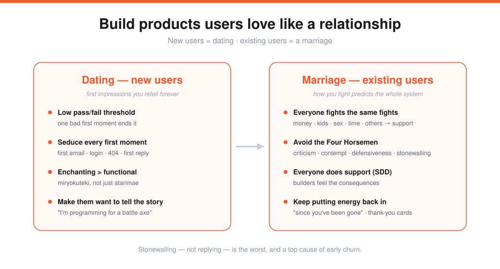
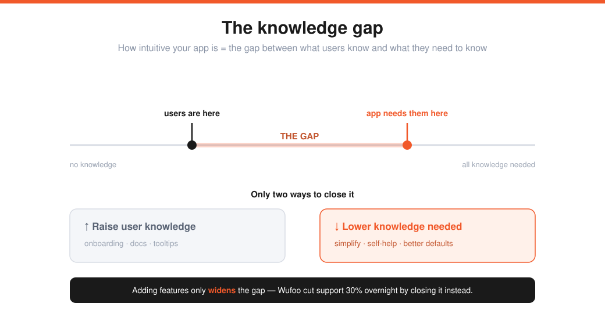

# Kevin Hale — How to Build Products Users Love, Part I (Lecture 7)

> Source: Stanford CS183B, Lecture 7 (Oct 14, 2014). Kevin Hale (co-founder of Wufoo; YC partner).
> Transcript: https://genius.com/Kevin-hale-lecture-7-how-to-build-products-users-love-part-i-annotated
> The emotional craft beneath [Building Product & Growing](04-product-users-growth-adora-cheung.md)'s retention and [Growth](06-growth-alex-schultz.md)'s churn.

**Wufoo** — an online form builder, "a database app that looks like it was designed by Fisher-Price." YC W2006, team of 10, run from home in Florida, acquired by SurveyMonkey (2011). The outlier economics: the average startup raises ~$25M for a ~676% return; **Wufoo raised ~$118k for a ~29,561% return.**

> Philosophy: *the best way to get to $1B is to focus on the values that earn the first dollar and the first user.* Get that right and the rest takes care of itself.

Growth = the gap between **conversion** and **churn** — but Hale looks at it at **human scale**, through the intimate early interactions. Two metaphors organize everything:

---

## New users = dating (first impressions)
We retell origin stories (first kiss, how we met) — and we do the same with products. Humans are *"relationship-manufacturing creatures"*: we anthropomorphize the tools we use and assign them a personality.

- **First impressions have a far lower pass/fail threshold.** Catch a first date picking their nose → no second date. Catch your spouse of 20 years doing it → you shrug. So the *first* email, login, link, ad, and support reply are all **opportunities to seduce.**
- **Two kinds of quality (Japanese):** *atarimae hinshitsu* = "taken-for-granted quality" (it functions) and *miryokuteki hinshitsu* = "enchanting quality" (a pen's weight, ink flow, how the handwriting is perceived). Aim past functional to enchanting.

**Examples of enchanting first moments:** Wufoo's "RARRR!" dinosaur login tooltip · Vimeo playing fart noises when you search "fart" · Cork'd's signup form written as a *poem* · Flickr's "Get in there!" · Heroku's slider signup · Hurl's 404 unicorn · MailChimp redesigning help guides like magazine covers (readership ↑, support ↓) · Stripe auto-filling *your real API keys* into the docs.

> **Wufoo's API launch:** instead of giving away iPads (like everyone), they had armor.com forge a **custom battle axe** as the contest prize. "I'm programming for a weapon" → **25+ apps** they could never have paid for. They changed how people *told the origin story.*

---

## Existing users = marriage (the long term) — John Gottman
Gottman predicts divorce within 4 years at **85%** accuracy from a 15-minute fight video (94% with an hour + hopes & dreams). Counselors, priests, and sociologists can't beat chance.

**Everybody fights — about the same five things**, which map directly to customer support:

| Couples fight about | In your product |
|---|---|
| Money | pricing, credit-card trouble |
| Kids | users' own clients |
| Sex | performance — uptime, speed |
| Time | — |
| Others (jealousy, in-laws) | competitors, partnerships |

Support sits *between every step of the funnel* — it's the thing that stops conversion.

### The broken feedback loop → Support-Driven Development
Most teams are **divorced from the consequences of their actions.** Pre-launch is bliss (every line of code feels like genius); post-launch, technical cofounders silo off the "inferior" work to get back to that bliss.

> **SDD = make everyone do customer support.** It injects responsibility, accountability, humility, modesty — and the people who *built* the software give the best support.

Paul English put a **red support phone in the middle of Kayak's engineering floor**: after the second or third identical call, the engineer just fixes the bug. QA as an elegant side effect.

### The Four Horsemen (Gottman's warning signs → support)
| Horseman | What it is | In support |
|---|---|---|
| **Criticism** | attacking the overarching ("you *never* listen") not the issue | — |
| **Contempt** | deliberately insulting the other | — |
| **Defensiveness** | excuses instead of accountability | common as companies age |
| **Stonewalling** | shutting down / not responding | **the worst** — startups do this constantly; *not replying* is a top cause of early churn |

**Wufoo's bar:** 500k users / 5M people touched, supported by 10 people. ~400 issues a week, response **7–12 min** (9am–9pm), <24 hr on weekends. (Airbnb's Joe Gebbia wore a phone headset doing nonstop support; their growth picked up when they matched support capacity to demand.)

---

## Two experiments that paid off
- **Emotion dropdown.** Wufoo added "what's your emotional state?" to the support form, expecting nobody to use it. It was filled **75.8%** of the time (vs. 78.1% for "browser type"). Bonus: people got *nicer* — the three written signals of strong emotion (exclamation marks, curse words, ALL CAPS) all dropped once people had an emotional outlet.
- **Direct exposure → better software** (Jared Spool). There's a direct correlation between time **directly** exposed to users and design quality. It must be direct (not a report/graph), roughly real-time, **≥2 hours, at least every 6 weeks** — or software gets *worse.* Wufoo devs got 4–8 hours/week.

### The knowledge gap (Jared Spool)

Picture a spectrum from *no knowledge* to *all the knowledge needed* to use your app. The distance between where users **are** and where they **need to be** is the **knowledge gap** — that's how intuitive your app is. Only two ways to close it:
1. **Increase** the user's knowledge (onboarding, docs, tooltips), or
2. **Decrease** the knowledge needed.

> **Adding features only *widens* the gap.** Wufoo spent **30% of engineering time** on support/self-help tooling (FAQs, contextual help links). One documentation redesign cut support **30% overnight.**

---

## Conversion vs. churn — the cheap lever
Wufoo's 5-year growth was **all word-of-mouth, zero ad spend.**

> A **1% increase in conversion** and a **1% decrease in churn** do the *exact same thing* to growth — but reducing churn is **easier and cheaper**, and usually neglected (handed to the "B team").

### Keep putting energy back in (2nd law of thermodynamics)
Some couples divorce after 10–15 years with no warning signs — just **no passion left.** Relationships run down; you must keep adding energy.

- **"Since you've been gone"** alert: on login, Wufoo showed everything shipped since your last visit. Most talked-about feature — users felt they got maximum value at the same price.
- **Say thank you.** Every Friday, handwritten thank-you cards (index card + sticker + dinosaur). It started as Christmas cards to all users; year two they wrote only to top payers — until a loyal user wrote *"I haven't gotten my second card yet, I know you didn't forget me."* Lesson: **don't set expectations you can't keep** — make it a weekly practice instead.

---

## Three disciplines of market leaders (HBR — Treacy & Wiersema)
| Discipline | Organize around | Example |
|---|---|---|
| Best **price** | logistics | Walmart, Amazon |
| Best **product** | R&D | Apple |
| Best **overall solution** | **customer intimacy** | luxury brands, hospitality |

> Only the third — **customer intimacy** — is available to **anyone at any stage.** It costs almost no money: just humility and some manners.

---

## Sharp Q&A nuggets
- **Many user types?** Focus on the most *passionate* niche first (Pinterest → design bloggers); universal values emerge later. Humor is hard — get *atarimae* (functionality) right before trying to be witty, or it backfires.
- **Product vs. marketing?** Always pair building with talking to users (via support). *"Marketing and sales is a tax you pay because you haven't made your product remarkable."* Give people a story where they're the most interesting one at the dinner table — that person becomes your salesforce.
- **Deciding direction?** Read support to see what people struggle with; don't just build what they ask (you'd be a slave) — solve the underlying need. Ship the smallest version (1–2 weeks) to test.
- **"King for a Day"** (instead of hackathons, where 99% never ship): randomly crown someone who directs everyone's product resources for 48h on what bugs them. 1–2×/year — huge morale boost.
- **Remote work?** Respect time. 4.5-day week (meetings/bizdev only on the Friday half-day, 1 day support → 3 solid build days). The **15-minute rule:** stuck >15 min → table it for Friday; 90% never came back (they slept on it and solved it). Only site-down and broken-payments need real-time fixing.
- **Hiring remote:** contract a ~1-month side project first; screen for empathy by having them write a **"break-up letter"** in 15 min (90% of support is delivering bad news).
- **Failed experiment:** the "Trip Bitch" crunch contest demoralized whoever fell behind — *recovery needed > productivity gained.* Never repeated.

---

## My action items
- [ ] **First moments:** Which first interactions (email, login, 404, first support reply) could I make *enchanting*, not just functional?
- [ ] **Support loop:** Does everyone who builds also support? Am I ever stonewalling (not replying)?
- [ ] **Knowledge gap:** Am I closing it by *lowering knowledge needed* — or just adding features that widen it?
- [ ] **Churn:** Am I spending on the cheap lever (reduce churn) or only chasing conversion?
- [ ] **Customer intimacy:** What's my version of the "since you've been gone" note and the handwritten thank-you?
