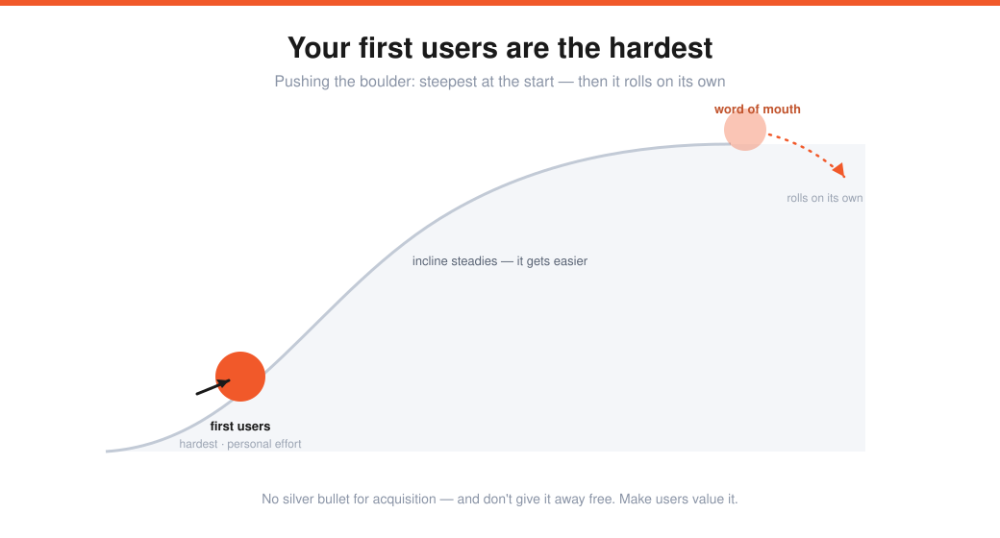
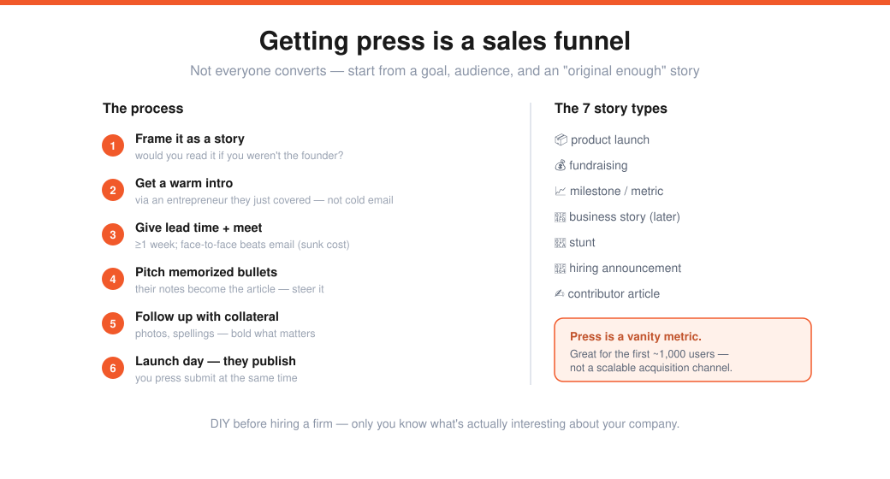

# Doing Things That Don't Scale, PR & How to Get Started (Lecture 8)

> Source: Stanford CS183B, Lecture 8 (Oct 16, 2014). Stanley Tang (DoorDash), Walker Williams (Teespring), Justin Kan (Justin.tv / Twitch).
> Transcript: https://genius.com/Walker-williams-lecture-8-doing-things-that-dont-scale-pr-and-how-to-get-started-annotated
> The hands-on counterpart to [[04-product-users-growth-adora-cheung]] and the PR layer on [[06-growth-alex-schultz]].

Three founders, one theme: **doing things that don't scale is your biggest early advantage** — plus how press actually works.

---

## Stanley Tang — DoorDash: test the hypothesis, launch in an hour
DoorDash (on-demand local delivery) started when two Stanford juniors interviewed Chloe at a Palo Alto macaroon store. She pulled out a thick booklet of **delivery orders she'd had to turn down** (no drivers). Talking to **150–200 small-business owners**, delivery was a universal pain.

> "Why hasn't anyone solved this?" Hypothesis: maybe there's no consumer demand. How to test it cheaply *without* trucks or a fleet?

- **The experiment:** an afternoon's work — `PaloAltoDelivery.com`, a few PDF menus found online, and their **personal cell number** at the bottom. Ugly, no backend, **launched in ~1 hour.**
- First order: Thai food to a guy on Alpine Rd (author of *Weed the People*). Then 2 → 5 → 7 → 10 orders/day — for a site where you look up PDFs and *call*. People tolerating a terrible experience = a **strong need.**
- **Things that don't scale:** they were the drivers (between classes), support (calls during lectures), and marketing (flyers on University Ave). The "system" was Square + a Google Doc + Find My Friends. (Square once shut them down for suspected money laundering — rapid $15–20 orders — until cofounder Tony emailed friends there.)
- It made them **experts in the business:** driving taught the delivery flow; manual dispatch shaped the assignment algorithm; doing support gave real-time feedback. They emailed *every* new customer nightly, personalized ("I love Oren's Hummus — how were the chicken skewers?").

> **Three lessons:** (1) **test your hypothesis** — treat ideas as experiments; (2) **launch fast** (<1 hr); (3) **it's okay to do things that don't scale** — figure out scaling once you have demand. *Then* you get the ice cream.

---

## Walker Williams — Teespring: first users, champions, product-market fit
Teespring (launch apparel/products with no risk or cost) is ~180 people shipping tens of thousands of products/day. **Things that don't scale** = fundamentally unsustainable strategies that won't bring the millionth user — and that's exactly why they're an advantage.

### 1. Finding your first users

- **There's no silver bullet** for user acquisition. The dream campaign/partnership/unicorn doesn't exist for most. Companies that *look* like they had a dream curve fought brutally for their first users.
- **Teespring 2012:** days of meetings, free designs, endless revisions — to sell ~50 shirts / ~$1,000 to one nonprofit. Looked hopeless. But users add up.
- A brand-new product means **you're bad at selling it** (you don't know the pain points, have no testimonials). First users are always hardest — it's the founder's job to do *whatever it takes*: 100 emails/day, cold calls, networks (Stanford, YC).
- **Don't measure first-user ROI by time** — those first users need handholding and personal love. That's essential.
- ⚠️ **Don't give the product away free.** It's unsustainable and gives a false sense of security (free users behave differently; "surely we'll convert them" rarely holds). Make sure users *value* it.

### 2. Turning users into champions
A **champion** advocates for you. Delight them with an exceptional, memorable experience — and early, the unscalable way is to **talk to users constantly.** (Walker is still Teespring's catch-all email, does 10–20 tickets/day, reads every tweet.) Three ways:

| Way | Detail |
|---|---|
| **Run support yourself** | Painful — the instinct is to pass it off. Resist. (Walker & Evan did all of it until $130–140k/month.) |
| **Reach out to current & churned users** | Find out *why* people leave — the outreach itself can win them back, or teach you what to fix. |
| **Monitor social & communities** | Know how people talk about your brand and **always make it right.** One detractor reverses 10 champions; a frustrated customer made whole becomes your biggest champion. |

### 3. Finding product-market fit
The product you launch with **won't** be the one that scales — so iterate fast and **optimize for speed over scalability and clean code.** (Enterprise ask: instead of building it "right" in ~1 month, Evan duplicated the codebase/DB to ship a separate product in **3–4 days**, then folded the core features back in.)

> **Only worry about the next order of magnitude** — at 10 users, figure out 100, not 1M. Necessity is the mother of invention (Twitter's Fail Whale; Teespring crashed nightly while the team slept with phones on loud to restart servers). Those are speed-bumps — **speed matters most early.**

**Do things that don't scale as long as humanly possible.** There's no magic moment (not Series A, not a revenue milestone) — it's your biggest advantage and "should be ripped from you," not given up. (On entering "competitive" T-shirts: great ideas look silly; Walker had a real personal pain point — a "Remember the Bar" shirt at Brown — and felt fast adoption, "the wind at his back.")

---

## Justin Kan — PR: how press actually works
Press is **not a meritocracy** and doesn't happen magically.

**Start from the goal and audience, not "be in the news."** Aimless coverage does nothing.
- Socialcam → known as "video Instagram" → **tech press** for SV investors.
- Exec (SF cleaning) → **local press** (SF Chronicle); national was useless (99% couldn't use it).
- Twitch → "ESPN for gamers" → **industry trades & game-dev blogs.**

### The seven story types
Product launch · **fundraising** (press loves it though it's dull) · **milestones/metrics** ($1M/week) · business stories (later-stage, NYT/New Yorker) · **stunts** (WePay's block of ice with frozen money outside a PayPal conference) · hiring announcements · contributor articles (op-eds).

> **Objectivity test:** if you weren't the founder, would you want to read this? And aim for **"original enough"** — novel *in context.* Don't be the *second* company to raise $5M on Kickstarter; the first in a category gets all the news.

### The process (a sales funnel — not everyone converts)
1. **Frame it as a story.**
2. **Get a warm intro** — via an entrepreneur the reporter just covered (an easy favor; transitive credibility). Cold email is far worse.
3. **Give lead time** (≥1 week). "Launching tomorrow, get me in TechCrunch" won't happen.
4. **Get face-to-face** (or phone). Sunk-cost fallacy: the more time they invest, the more likely they write. Email-only is ignored.
5. **Pitch:** write the ideal story as bullet points, **memorize it**, and steer the conversation so their notes become the article (cofounder's name, key features).
6. **Follow up** a day or two before launch with collateral (video/photos/spellings) — bold what matters.
7. **Launch day:** you press submit, they publish.

### Caveats
- **DIY first.** PR firms only provide contacts/logistics — they can't tell you what's *interesting* about your company. They're expensive ($5–20k/month); rarely worth it early.
- **Press is a vanity metric** — it feels like success but isn't revenue/users/happiness. Good for the first ~100–1,000 customers; **not a user-scalable channel** (people tire of you fast — news must be *new*). For a regular heartbeat, schedule spaced news against the seven types.
- **Relationships:** keep a few reporters warm — for breaking news and to tell your side when negative stories come. **Pay it forward** by sending reporters other good leads; it comes back.
- Resources: Jason Kincaid (ex-TechCrunch) overview; *Trust Me, I'm Lying* (Ryan Holiday) on how stories spread. (Twitch Plays Pokémon was community-originated — Twitch just "set the stage" with prior coverage and stayed available to reporters.)

---

## My action items
- [ ] **Test cheaply:** What's my one-hour landing-page experiment to validate demand before building?
- [ ] **First users:** Am I doing whatever it takes — personally — to push the boulder, without giving the product away free?
- [ ] **Champions:** Am I talking to users daily, reaching out to churned ones, and *always making it right*?
- [ ] **Speed > scale:** Am I optimizing for the next 10×, not the millionth user?
- [ ] **Press:** Do I have a real goal/audience and an "original enough" story — or am I chasing a vanity metric?
