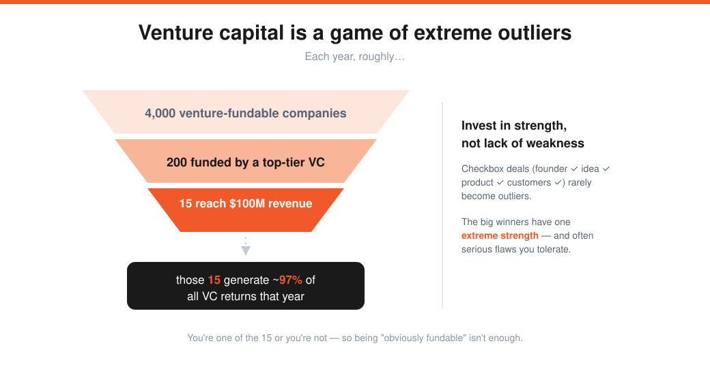
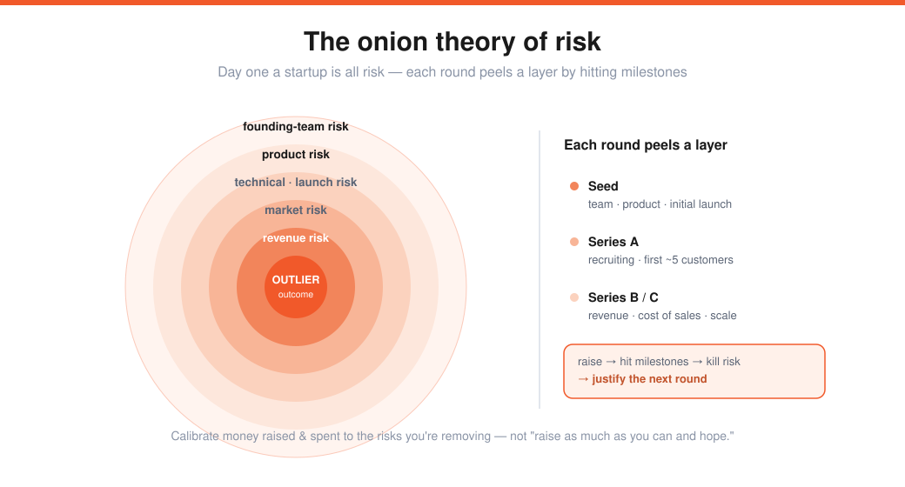

# How to Raise Money (Lecture 9)

> Source: Stanford CS183B, Lecture 9 (Oct 21, 2014). Panel: Marc Andreessen (a16z), Ron Conway (SV Angel), Parker Conrad (Zenefits), moderated by Sam Altman.
> Transcript: https://genius.com/Marc-andreessen-lecture-9-how-to-raise-money-annotated
> The capital layer over [Monopoly Theory](05-monopoly-theory-peter-thiel.md) and [Don't Scale & PR](08-dont-scale-and-pr.md).

The headline tension of the whole panel: **fundraising barely matters compared to building a great business.** "Be so good they can't ignore you."

---

## What makes them invest
**Ron Conway** (SV Angel, 700+ companies since 1994), within the first minute:
- Is this person a **leader**? Rightful, focused, **obsessed by the product**?
- First question: *"What inspired you to create this?"* — hoping it solves the founder's **own personal problem.**
- **Communication skills** + born leader (some can be learned, but take charge).
- Tactically: nail the **one-sentence description** (25% of founders he *still* doesn't understand after sentence one). And **be decisive** — "procrastination is the devil in startups."

**Marc Andreessen** — two concepts:

1. **VC is 100% a game of extreme outliers.** ~4,000 venture-fundable companies/yr → ~200 funded by a top-tier VC → ~15 ever reach $100M revenue → **those 15 generate ~97% of the entire category's returns** that year. You're in the 15 or you're not.
2. **Invest in strength, not lack of weakness.** The default is checkbox investing (good founder ✓ idea ✓ product ✓ customers ✓) — but checkbox deals lack an *extreme* strength. Companies with extreme strengths often have **serious flaws**, and *"if you don't invest in the ones with serious flaws, you don't invest in most of the big winners."* Aspire to one extreme strength on an important dimension, and tolerate some weakness.

---

## Be so good they can't ignore you
**Parker Conrad's** story: his prior company pitched **~60 VCs, all no.** A Khosla VC told him *"if you were the Twitter guys you could put anything up and we'd invest — you're not, so make it easy for us."* Parker took the **opposite** lesson: *figure out how to be the Twitter guys.*

- He started Zenefits partly because it looked like a business he could build **without raising at all** (enough cash flow). Ironically, those are exactly the businesses investors love → made it incredibly easy.
- Ron: **bootstrap as long as you can.** ("When will you raise?" "I might not." "That's awesome.")
- Marc (via Steve Martin's *Born Standing Up*): **"Be so good they can't ignore you."** You're almost always better off making your **business** better than your **pitch** better.

> **The cautionary flip:** raising VC is *the easiest thing a founder will ever do* — easier than recruiting engineer #20, selling to enterprise, getting viral growth, or earning ad revenue. If raising is hard, it's nothing next to what follows. **Raising money is not a milestone** — it just *positions* you to do the harder things.

---

## The onion theory of risk (Andy Rachleff → Marc)

A startup on day one has **every conceivable risk** — team, product, technical, launch, market-acceptance, revenue, cost-of-sales, viral-growth. Running a startup *and* raising money is **peeling away layers of risk by hitting milestones.**

| Round | Risks you peel |
|---|---|
| **Seed** | founding-team, product, maybe initial launch |
| **Series A** | more product, recruiting (full eng team), first ~5 customers |
| **Series B/C** | revenue, cost-of-sales, scale |

Pitch by telling the **risk-elimination story:** "raised seed → hit these milestones → killed these risks → raised A → … now raising B; here are my risks/milestones, and here's where I'll be at C." Then **calibrate money raised and spent to the risks you're removing** — the opposite of "raise as much as possible, build fancy offices, hire everyone, hope for the best."

---

## Tactics (Ron)
- **Never ask an investor to sign an NDA** — it signals distrust, and the whole relationship runs on trust.
- **Get everything in writing.** The biggest mistake. Investors have short memories — after a commitment, email to confirm (valuation, co-investor); resend it when they wriggle.
- Run the process **quickly and efficiently; don't obsess.** Founders make it an ego victory — it's the tiniest step. Hurry up and get it done.

## The process
- **SV Angel (seed):** first money in, ~$1–2M rounds (they put ~$250k → 5–6 co-investors). Invest in ~**1 of every 30**, ~1/week, all from their network. Flow: great short exec summary → team **votes** whether to even make the call → domain expert calls → meeting (*"if SV Angel asks for a meeting, we're well on our way"*) → back-channel checks → commit → help build the syndicate.
- **a16z (Series A):** top-tier VCs fund Series A in two cases: **(1)** the company already raised a seed (almost always — so **raise seed first**), or **(2)** a proven/known founder. ~2,000 referrals/yr — **best path to A intros is through your seed investors or YC.**

## Terms & negotiation
- **Seed:** the single most important thing is **picking the right seed investors** — they lay the foundation and make the intros (a trusted, enthusiastic intro >> a lukewarm one). YC's ratings proved accurate; the "okay" investors were duds.
- **Valuation thresholds are real.** Parker tried a $12–15M cap → "crazy"; dropped to **$9M** → hit a magic sub-$10M threshold → near-infinite demand, closed in ~a week. **Get what you need, not more, and get it done** — 12 vs 9 vs 6 isn't a big deal long-term.
- **How much to sell:** Series A ≈ **20–30%** (VCs are *ownership*-focused, not price-focused — they'll pay more to keep ≥20%; above 30% the cap table gets weird). Seed ≈ **10–15%.**
- **Don't over-dilute.** Ron: ask *"at what point does my ownership start to demotivate me?"* A 40% angel round → you'll own <5% → doomed. Marc: a16z will **walk** from a destroyed cap table (one company's outside investors already owned **80%** — demotivating for the team).

---

## Best-investment stories
- **Google (Ron, 1999) — "a googol return."** Met via Stanford prof / fund LP David Cheriton at a tuxedo party; "BackRub," PageRank + relevancy (not obvious in 1998). Called every month for 5 months to get an audition; Larry & Sergey said "you can invest *if* you get Sequoia." He **earned his way in.**
- **Airbnb (Marc, 2011, ~$1B growth round).** a16z **passed** the first time — "a website where strangers stay in your house" combined two of the most-nuts ideas imaginable. The numbers proved them wrong; a multistage firm lets you **fix mistakes and pay up later.** And the three founders kept **maturing into** the job (some "grow into" the big job, half "swell into it").
- Ron: Airbnb is great because **all three founders are equally good** — rare. **Find a co-founder as good or better than you** → odds rise astronomically. (Solo Zuckerberg is the outlier.)

---

## Sharp Q&A nuggets
- **Raise to enable an exit / acqui-hire?** Yes, but don't let it drive the decision — *"you can't plan according to the downside."* It might affect *which* investor, not *whether* to raise.
- **Capital-intensive (non-software) business?** Double down on the onion theory — be precise on milestones/risk per round, raise close to the *exact* amount (over-raising the A wrecks you via cumulative dilution), and show **operational excellence** through a precise plan. Venture debt / lease financing can help, but they demand even more precision (a tripped covenant can cost you the company).
- **Sign you should NOT take an investor's money?** No domain expertise, no helpful rolodex, in it just for money. Marc: **choosing key investors is a marriage** — a 10–20-year journey (longer than the average American marriage). If everything goes great it doesn't matter who they are — but it never all goes great. *That's* worth more than +$5M of valuation.
- **Parker's meeting test:** do you respect them and feel you'd *learn* from them? A great VC leaves you with a clearer picture even if they don't invest.
- **The real VC constraint = opportunity cost.** Two costs per deal: **(1) conflict** — invest in only **one company per category**; every deal locks you out (invest in MySpace, can't do Facebook a year later), and you only know today's companies, not the future winner; **(2) bandwidth** — a partner can sit on ~**10–12 boards** max; board seats are a limited "punch card." So they pass on "fairly good, obviously fundable" companies to keep slots for *better* ones.
- **Invest with no product?** Ron: back the **team first** — the idea morphs (lower valuation pre-users unless a founder has a track record). Marc: in enterprise/SaaS there's often **no MVP** (customers need a full product), so they fund $5–10M to build it in the A — but almost always a **proven founder.**
- **Board structure?** Parker: founder + co-founder + one partner; trust removes fear of arbitrary firing. **Things almost never come to a board vote** — most VC power is in protective covenants, not votes. Doing well → you have unlimited power regardless of structure; doing badly → no protection matters. Marc: in 20 years, **never an important board vote that mattered** — the decision is always clear and almost always unanimous by the end.

---

## My action items
- [ ] **Outlier or checkbox?** What is my one *extreme strength* — not just a row of ticked boxes?
- [ ] **Risk map:** What risks does each round I raise actually peel away, and am I raising/spending in proportion?
- [ ] **Be so good:** Am I making the *business* better, not just the pitch? Could I bootstrap longer?
- [ ] **Right investors:** Would I marry these people for 10–20 years? Do I respect them and learn from them?
- [ ] **Don't over-dilute:** Will I still own enough to stay motivated after this round?
