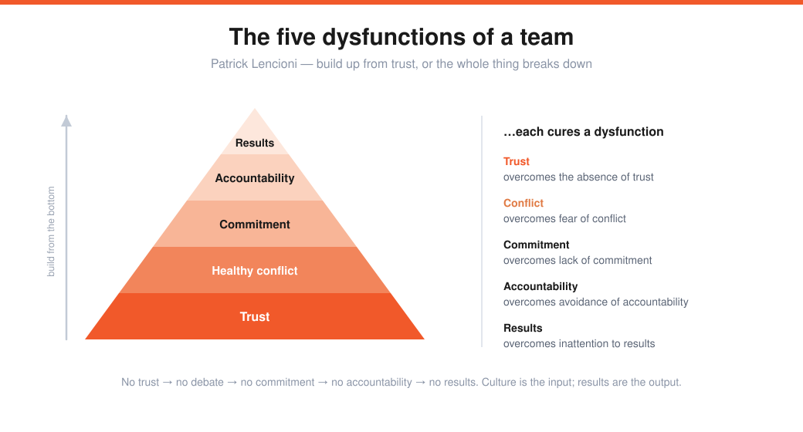
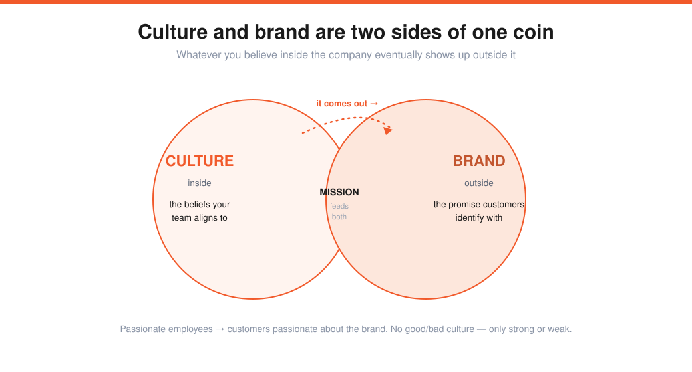

# Company Culture & Building a Team, Part I (Lecture 10)

> Source: Stanford CS183B, Lecture 10 (Oct 23, 2014). Alfred Lin (Zappos COO, Sequoia partner) + Brian Chesky (co-founder/CEO, Airbnb).
> Transcript: https://genius.com/Alfred-lin-lecture-10-company-culture-and-building-a-team-part-i-annotated
> The team layer beneath [[02-teams-and-execution]] and the love behind [[07-products-users-love-kevin-hale]].

You've built a product, found growth, and chased a monopoly market — **culture is what scales the business and the team from here.**

---

## Alfred Lin — what culture is and why it matters
**Company culture =** "Every day, the **core values** and **actions** of each member of the team in pursuit of our **mission**."

> Gandhi: *beliefs → thoughts → words → actions → habits → values → destiny.* Without a good culture, you can't pursue your destiny.

**Why it matters:** it's the first principles you return to for decisions; it **aligns** people, provides **stability** and **trust**, and gives a list of what to do — and, more importantly, **what *not* to do**; and it lets you **retain** the right people. (And it's not just soft: the "100 Best Companies to Work For" returned **11.8%** from 1994–2013 — nearly double the S&P 500 / Russell 3000.)

### How to create core values
Start with the founder: what values matter most to you and to the business? Who do you love working with — and what are *their* values? Think of people you've **disliked** working with; the **opposite** of their values may be yours. Then two final checks: values must be **credible** and **uniquely tied to your mission.**

> Zappos: *"Deliver WOW through service"* (uniquely tied to a customer-service mission); *"Be humble"* (opposite of the arrogant people they didn't want).

**Go deep.** Zappos polled employees → **37** candidate values → whittled to **~10**, and it took a **year.** "Honesty" is meaningless (nobody wants to be lied to); "service" and "teamwork" need real depth. Company first, then department, then team, then yourself.

### The Five Dysfunctions of a Team (Patrick Lencioni)

Teams break from the bottom up: **no trust → no healthy conflict → no real commitment → no accountability → no results.** Culture is a major *input* to the company "black box"; product and financials are the *output.*

**Best practices:** bake the mission into the values; think *harder and longer* about them than feels necessary; **interview for culture fit, not just skill** (the smartest engineer who doesn't believe the mission won't pour their heart in); and make culture a **daily habit** — like fitness, skip it and you slowly get out of shape (crash diets don't work).

---

## Brian Chesky — building Airbnb's culture
Airbnb was *never* the big idea — just rent money ($1,000 in the bank, $1,150 rent, a sold-out design conference, three air mattresses) so they could *think* of the big idea. Solving their own problem **became** the big idea.

- **Luck = great co-founders.** Build a team so talented they make you *uncomfortable* — you'll have to raise your game.
- **Founders are parents; the company is the child.** Dysfunctional parents → a "pretty fucked up" child. The three were a family — 18 hours a day, 7 days a week — with shared accountability that became the company's **DNA.**
- **Phase two = building the company that builds the product.** A great product won't endure without a great company. Enduring companies (Apple: *"our products change but our values never have"*) share a clear mission, clear values, and a unique way of doing things → **culture must be designed.**

### What Tony Hsieh taught him
Culture has two parts: **behaviors** (change over decades) and **enduring principles** (never change — they make you *you*). Integrity and honesty aren't core values — *everyone* should have those; you need **3–6 things unique to you.** Tony's regret: writing values only at 100 employees. **Airbnb wrote its core values *before hiring anyone.***

> The first engineer is a **"DNA chip"** — if you succeed there'll be 1,000 people like them. Want diversity of background and age, but **homogeneous values** — values are the one thing that shouldn't be diverse. (They looked 4–5 months for that first hire.)

### Two of Airbnb's six core values
1. **Champion the mission.** Hire people here for the *mission* — not the valuation, the office, or because it's hot. Airbnb's mission isn't booking rooms; it's **"belong anywhere"** (the Sebastian/London-riots story: *seven* past Airbnb guests called to check on him before his own mother did). Champion = *live* it, believe it, have stories, use the product. The interview question: *"if you had 10 years left to live, would you take this job?"* The two bricklayers — one *"building a wall,"* one *"building a cathedral."* **Hire for a calling, not a job.**
2. **Be a "cereal entrepreneur" (be frugal/scrappy).** Obama O's and Cap'n McCain's cereal made **$40k** when 15 investors had said no (10% for $150k) and the site had 100 visitors/day and *2 bookings.* **Constraints bring out creativity** — raising $800M makes it easy to lose that scrappiness.

### Why culture is hard — the three things nobody tells you
1. **Nobody talks about it** (endless articles on product and growth, almost none on culture).
2. **It's hard to measure** — so it gets discounted.
3. **It doesn't pay off short-term** — if you wanted to sell in a year, the move would be to *fuck up the culture* and hire fast. Culture forces you to hire **slowly and deliberately.**

### Hiring and the hard calls
- **Hire and fire on values.** *"If you could hire anyone in the world, would you hire the person across from you?"* Every hire should *raise the bar.* Use **separate core-values interviewers** outside the function (no skill bias). Say no to great people who don't feel right long-term.
- **Missionaries vs. mercenaries.** When the Samwer brothers cloned Airbnb (400 people hired in 30 days, threatening to destroy them internationally), the pragmatic move was to *buy* them. Chesky refused — *"missionaries outlast mercenaries"* — and let them run the clone long-term (*"you had the baby, now raise it"*). Europe is now **>50% of revenue.**

### Culture and brand are two sides of the same coin

**Culture** = the beliefs *inside* the company; **brand** = the promise *outside.* Whatever's inside eventually comes out. Your brand is decided by your employees (your evangelists) — passionate employees → customers passionate about the brand. There's no *good* or *bad* culture, only **strong or weak** (and a good culture for one company isn't good for another). Apple's 1997 *Think Different*: you win by talking about **what you value**, not bits and bytes — otherwise you're a **utility**, sold at commodity prices.

### The CEO's job and "do things that don't scale"
The CEO mostly **articulates the vision** → develops strategy → hires people who fit the culture — repeated thousands of times. And, echoing [[08-dont-scale-and-pr]]: **100 people who love you > 1M who like you.** They went door-to-door *living with* hosts (*"Steve Jobs won't sleep on your couch, but I will"*); the pro-photography program started by hand (a rented camera, homes shot in the snow, managed in spreadsheets) and only became software once they knew the perfect service. (Doug Leone: Airbnb has "the worst job of any CEO" — a tech + payments + trust-&-safety + regulatory + offline company in 190 countries. It's not a marketing company.)

---

## My action items
- [ ] **Definition:** Can I state my culture as *core values + actions in pursuit of the mission*?
- [ ] **3–6 unique values:** Not "integrity/honesty" — what's *uniquely* us, credible, and tied to the mission?
- [ ] **Five dysfunctions:** Do we have trust → healthy conflict → commitment → accountability → results?
- [ ] **Hire on values:** Do I run separate values interviews and only hire people who raise the bar?
- [ ] **Coin check:** Does what we believe *inside* match the promise customers feel *outside*?
