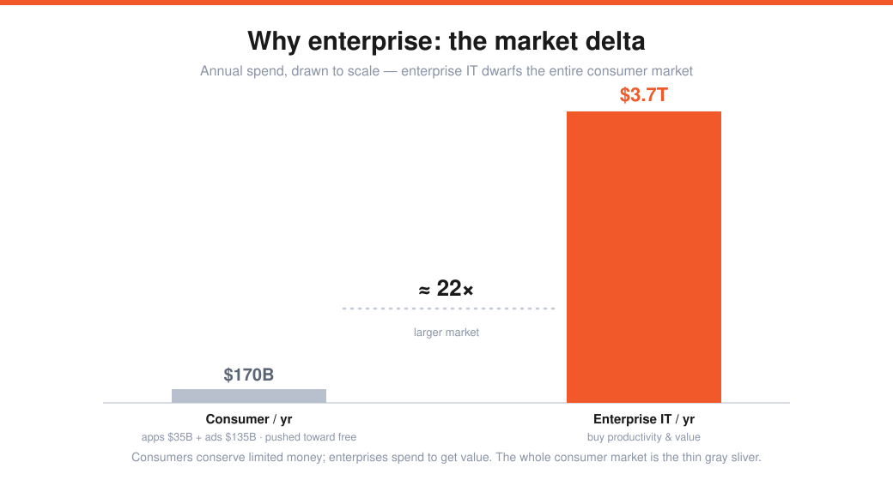
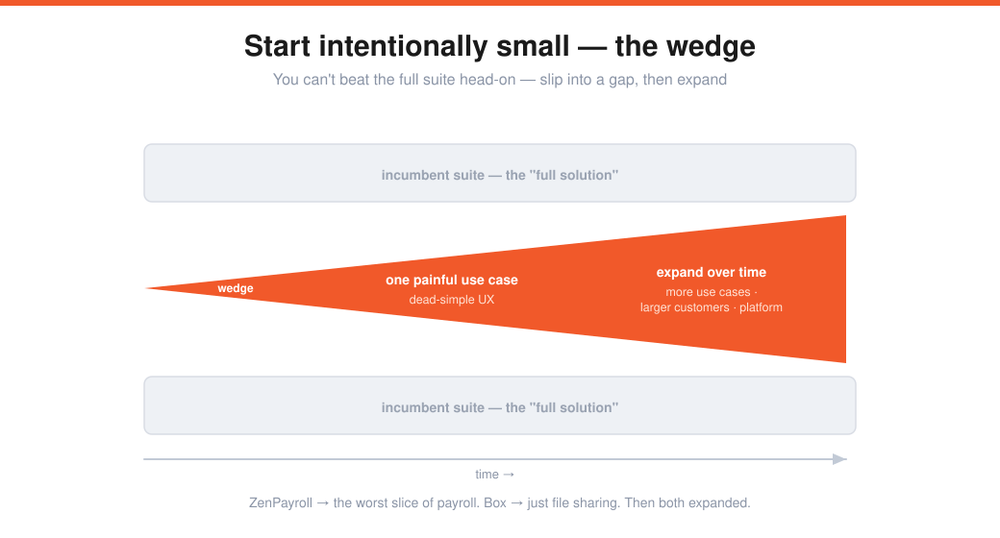

# Aaron Levie — Building for the Enterprise (Lecture 12)

> Source: Stanford CS183B, Lecture 12 (Oct 30, 2014). Aaron Levie (co-founder/CEO, Box). Titled "Sales and Marketing," but really a case for enterprise.
> Transcript: https://genius.com/Aaron-levie-lecture-12-sales-and-marketing-annotated
> The enterprise counterpoint to [[05-monopoly-theory-peter-thiel]] and [[08-dont-scale-and-pr]].

Levie's whole goal: convince you that **enterprise software is where to build** — and that the reasons it looks unsexy are exactly why it's a great opportunity now.

---

## Box's story
The idea came in college (2004): sharing files was expensive and painful (USC gave 50MB that auto-deleted every six months). Three enabling factors were shifting — **storage cost dropping fast, faster browsers/networks (Firefox), and more places people wanted their data.** → Box.net (2005): make it dead simple to store and share files anywhere. Angel money from Mark Cuban; they dropped out, went free, and got hundreds of thousands of signups a month.

**The squeeze:** too much product for consumers (who wouldn't pay for enterprise features), not enough security for enterprises. Stuck at a fork — and they chose enterprise.

### Why enterprise: the market delta

> Consumer ≈ **$170B/yr** (mobile apps $35B + global digital ads $135B) — and Google/Apple/Microsoft keep pushing prices toward **free.** Enterprise IT ≈ **$3.7 trillion/yr** — roughly **22× larger** — and the value equation is different: enterprises buy **productivity and value**, not "save a few dollars."

The catch: enterprise *was* unsexy — slow to build (you can't break things), glacial sales cycles (years to buy, years to implement), bloated software ("47 buttons on a page"), and a sales intermediary ("Chuck with a briefcase"). Investors in 2007 said a team of inexperienced 20-year-olds would be stomped by Microsoft/Oracle/IBM. They went anyway — bringing **consumer DNA** into enterprise and playing by a *different* set of rules. Today: 240k businesses, 27M users, 99% of the Fortune 500.

---

## Why now — what changed in enterprise
| Shift | What it unlocks |
|---|---|
| **Cloud** (Salesforce, AWS) | no installing servers at every customer → cheaper, on-demand compute → **lower adoption friction** |
| **Standardized software** | customize a *layer on top* instead of building bespoke platforms |
| **Reach** | serve a 2-person company *and* GE (300k employees) → much larger market |
| **Global from day one** | Box had international customers weeks in |
| **Mobile / user-led IT** *(the big one)* | ~2B smartphones; users bring their own tools, so you **get in through the end user**, then sell the enterprise on control/security/scale — flipping the incumbent's CIO relationship |

With ~3B people online, **every industry is being disrupted** and will need new software. Two moments of opportunity: when **raw materials change** (compute gets cheap/on-demand) or when **an enterprise's own customers need new experiences** (Uber/Instacart/Lyft forcing incumbents to adapt). Retail → omnichannel; healthcare → personalized/predictive, telemedicine, paying for *wellness*; media → linear → on-demand at 3B-person scale. Every industry will partner with "the technology industry."

---

## The patterns — how to build an enterprise startup

### Start intentionally small — the wedge

> You can't beat an incumbent's full solution head-on. Find a natural **sliver/gap**, make that one use case's UX *incredible*, then expand over time to more use cases and larger customers.

1. **Spot technology disruptions.** Find enabling tech or trends that open a **wide gap** between how things are done and how they *could* be. (Box: cheap storage + fast internet + better browsers, yet file-sharing was still cumbersome. PlanGrid: ~$4B/yr spent printing blueprints → the iPad as the perfect form factor for construction data.) Old newspapers show we keep retrying ideas that were once too expensive or unusable.
2. **Start small (the wedge).** A sliver today (one painful use case, or small businesses), expanding up-market over time. (ZenPayroll/Gusto: the most painful slice of payroll, dead simple, then move up.)
3. **Find asymmetries** — do what incumbents *can't or won't* (economics or tech). Be **platform-agnostic** where suite players are vertically integrated; or invent an **unusual business model** (Zenefits: free to the startup, paid by *insurance commissions*).
4. **Find the crazy-but-reasonable outliers** — customers at the bleeding edge "living in the future" (PG). Use them as early adopters to discover what's missing. (Skycatch: enterprise drones for construction/farming data capture.)
5. **Listen — but don't build exactly what they ask.** Distill their requests into the simplest best solution. (Palantir turns complex problems into simple solutions the customer couldn't have specified.)
6. **Modularize, don't customize** — build a platform + APIs; don't bake custom verticals into the product.
7. **Focus on the user.** Keep consumer DNA at the center → easier adoption, viral potential, easier to sell in. **The product should sell itself — but you still need sales** (domain-specific reps to help customers navigate the product and landscape, *not* a substitute for a great product). (Mixpanel: enters via the developer, then inside sales to the org.)

> Read: **Crossing the Chasm**, **The Innovator's Dilemma**, **Behind the Cloud.**

---

## My action items
- [ ] **Market delta:** Am I chasing a few consumer dollars, or value an enterprise will pay for?
- [ ] **What changed:** Which shift (cloud, mobile/user-led, an industry's own disruption) makes my idea possible *now*?
- [ ] **The wedge:** What single painful use case can I make dead-simple — and expand from?
- [ ] **Asymmetry:** What can I do that the incumbent *can't or won't* (platform-agnostic, unusual business model)?
- [ ] **User-led:** Can the product get in through the end user and sell itself — backed by domain sales, not replaced by it?
