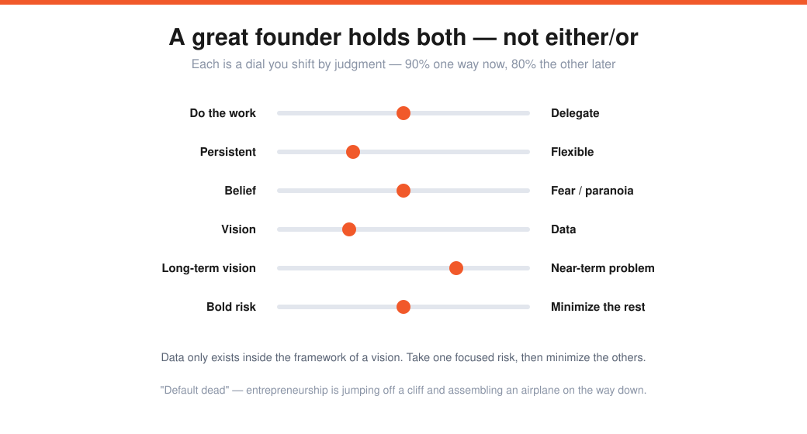
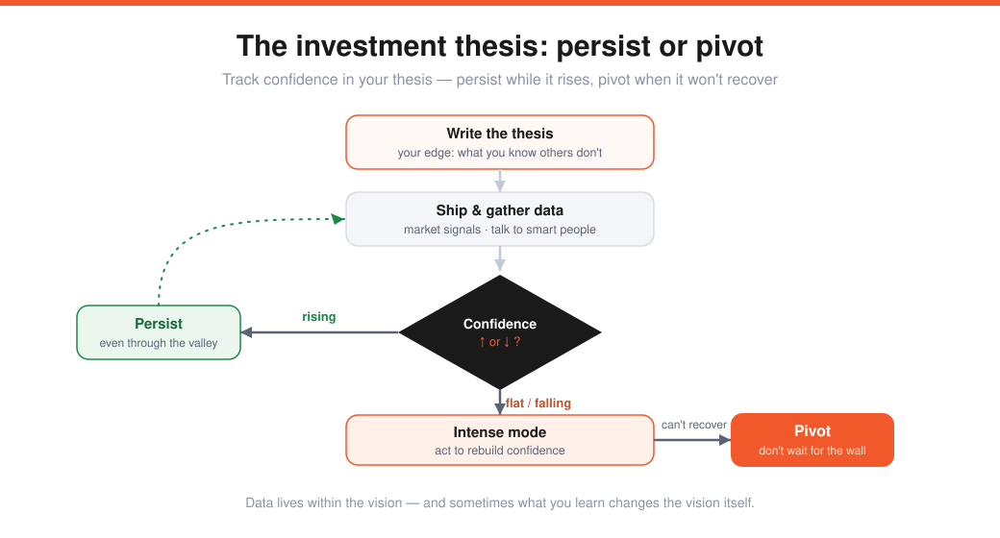

# Reid Hoffman — How to Be a Great Founder (Lecture 13)

> Source: Stanford CS183B, Lecture 13 (Nov 4, 2014). Reid Hoffman (co-founder LinkedIn, exec PayPal, partner Greylock).
> Transcript: https://genius.com/Reid-hoffman-lecture-13-how-to-be-a-great-founder-annotated
> The mindset layer over [[02-teams-and-execution]] and the founder side of [[09-how-to-raise-money]].

The question isn't "what skills must I max out?" — it's **how do you see yourself as a founder, and how do you navigate the job?**

---

## The super-founder myth
The icons (Jobs, Gates, Musk, Zuckerberg, Bezos) get painted as **Superman with a panopticon of skills** — great at product, strategy, management, fundraising, all of it. (Reid once read that "Bill Gates is smarter than Einstein.") **Reality:** a founder deals with endless headaches and **no one is universally powered.**

> You hope to have **a couple of superpowers** — a unique edge for you and the problem. Competitive edge matters enormously, but it's *not* a function of being a genius. (And madness vs. genius is hard to tell apart — the *results* decide.)

---

## Team & location: go where the networks are
- **2–3 founders beat a solo founder** (usually). Different skills cover each other's weaknesses across the diverse problems you'll hit. Demand **high trust** in your co-founders — a co-founder "divorce" a year in is frequently fatal.
- **Choose your location to match your task's networks.** Great founders **seek the networks essential to the work**, not "I'm Superman, I can do this in Antarctica." Silicon Valley is great for software/mobile/marketplaces — but **Groupon belonged in Chicago** (it needed a massive sales force, which the Valley is allergic to), and a *fashion* company shouldn't move here.

> The metaphor: **entrepreneurship is jumping off a cliff and assembling an airplane on the way down.** It's "default dead," so take every edge you can — including being where the right network is.

---

## Contrarian *and* right
It's easy to be contrarian; it's hard to be **contrarian and right.**
- **Contrarian is relative to an audience.** Test it: can a *smart expert* disagree with you? If no smart person would, it isn't really contrarian.
- The real question: **what do I know that others don't?** (Not "I'm brilliant.")

> **LinkedIn:** two-thirds of Reid's network thought he was nuts — a network product is worthless until it's huge, so it can't get started. What he knew that they didn't: he could **seed it via early believers** ("I think a product like this should exist") and grow to critical mass. That specific edge is what made it contrarian *and* right. (Other forms: a "small" idea is actually large; a **compounding curve** beats waiting for a rocketship — LinkedIn never had its rocketship moment, it compounded year by year.)

---

## The paradoxes a great founder holds

The job is full of apparent paradoxes — and the answer is almost always **both**, shifting the balance by judgment:

| Pole | …and pole | Note |
|---|---|---|
| Do the work | delegate | sometimes 100% each |
| Persistent | flexible | vision vs. listen-to-data |
| Belief | fear / paranoia | confident *and* patient |
| Internal focus | external focus | build vs. recruit/network |
| Vision | data | data only exists inside a vision's framework |
| Long-term vision | near-term problem | lose the vision → lost in a field; ignore today → hosed |
| Bold risk-taker | intelligent risk-minimizer | take a *focused* risk, then minimize the rest |

> "Be flexible across these lines — sometimes 90% one way, sometimes 80% the other — executing judgment on what the current problem looks like."

---

## The investment thesis — the operating tool

Write your (contrarian) thesis as a list of bullets — **including what you know that others don't.** Then, on the battlefield, constantly ask: **is my confidence in the thesis increasing or decreasing?**

- **Increasing → persist** (even through adversity — confidence can rise *despite* a "valley of the shadows" moment).
- **Decreasing → intense mode:** figure out what actions rebuild confidence. If that fails, **pivot.** The frequent mistake: waiting until you've crashed into the wall and can't maneuver.

> **PayPal, Aug 2000:** $12M in expenses exponentiating, no revenue, confidence falling → an action plan. The Palm-Pilot "beam cash" use case was seen to fail *before* launch → pivoted to **email payments.** The "new world currency" vision stayed true north through banking → debit → mass-merchant models. *Data lives within the framework of the vision — and sometimes what you learn changes the vision.*

### The strategy stack (each layer more fundamental)
**Product → product distribution → financing.** No matter how good the product, no customers = hosed; run out of money = hosed. So when you raise, you're already setting up the *next* raise — architecting distribution and financing together, not just "survive to the next round."

---

## Founders are diverse
Reid deliberately showed five white male icons — but founders vary by **age and experience** too (Jack Ma was a teacher). There's no single skill set: it's **the ability to learn and adapt**, hold a vision while taking input from all sources, and **assemble networks** while "crossing uneven ground in the fog."

---

## Sharp Q&A nuggets
- **Product distribution is the key strategy.** LinkedIn (2003) broke through because "the web was boring" — easy to get attention; today you need a **decisive edge / a hack you know.** (They chose **cold signups** over invite-only — the enthusiasts weren't the people they already knew.)
- **Judging founders = references.** Reid only meets people via a reference; he offered to invest in Airbnb *two minutes* in because he'd already referenced them. And look for **clarity/focus** — not a swiss-army-knife pitch — because you can't assemble a network behind a fuzzy mission.
- **"Infinite learning curve."** The #1 reference question is adaptability — each startup pattern is new; does the learning break down, or does **ego** get in the way? Watch for people who *mimic* flexibility but actually ignore you (ignoring you is fine; **ignoring the world is disaster**).
- **Great co-founding team = collaborates to get to truth.** Diversity of necessary strengths (≥1 technical, someone for business/fundraising) — but the real signal is them **reasoning with each other** ("here are the things that will kill us"), not singing Kumbaya.
- **Domain changes the attributes:** software → speed to market/learning; hardware → accuracy (ship wrong = dead); atoms/commerce → operational efficiency & margins. Navigating the paradoxes is the universal part.
- **No balance.** "If I ever hear a founder talk about a balanced life, they're not committed to winning." Be unbalanced and super-focused — maybe only for a couple of years.

---

## My action items
- [ ] **Superpowers:** What are my one or two real edges — and where am I covering weakness with a co-founder?
- [ ] **Contrarian & right:** Can a smart expert disagree with me? What do I know that they don't?
- [ ] **Thesis:** Is my written thesis's confidence rising or falling right now — persist, or enter intense mode?
- [ ] **Stack:** Is my distribution (and financing) at least as worked-out as my product?
- [ ] **Paradoxes:** Where do I need to consciously hold *both* poles instead of picking one?
