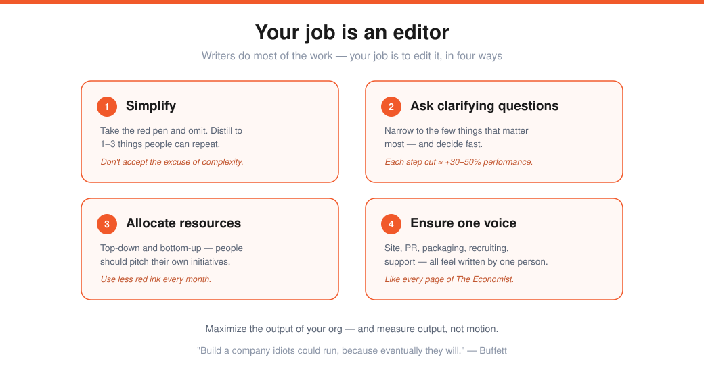
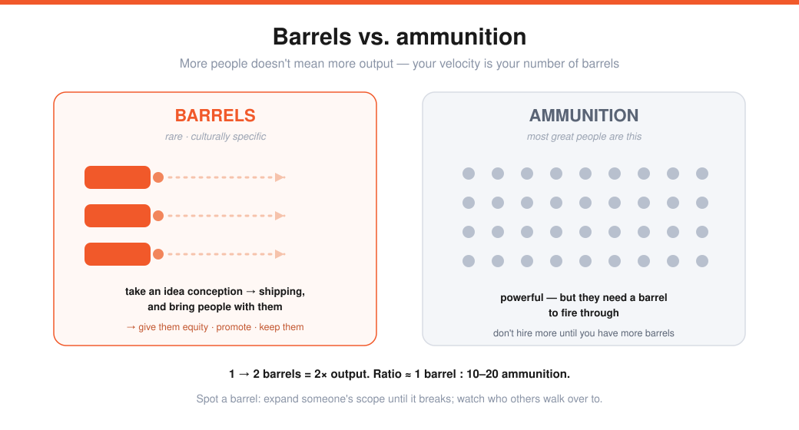

# Keith Rabois — How to Operate (Lecture 14)

> Source: Stanford CS183B, Lecture 14 (Nov 6, 2014). Keith Rabois (exec at PayPal, LinkedIn, Square; investor).
> Transcript: https://genius.com/Keith-rabois-lecture-14-how-to-operate-annotated
> Reading: Andy Grove, *High Output Management*; Bill Walsh, *The Score Takes Care of Itself*. The operating manual after [[13-how-to-be-a-great-founder-reid-hoffman]].

You've forged a product; now you forge a **company** — which is harder, because **people are irrational** (it's "all the irrational people you know in one building, 12 hours a day").

> You're building an **engine**: a whiteboard drawing → a duct-taped contraption held together by 80–100-hour weeks → eventually a high-performance machine almost no one has to babysit. The goal (Buffett): *"build a company idiots could run, because eventually they will."*

**Your job** (Andy Grove): **maximize the output of your organization and the organizations around you** — and measure **output, not input** (don't confuse motion with progress). In practice that's less glamorous than it sounds: ordering smoothies, teaching the receptionist to answer the phone, being a $10/hr TaskRabbit for your team. And early on it *should* feel like a mess — too much process means you're not innovating fast enough. You're constantly **triaging**: which problems are colds (ignore) and which look like colds but are fatal.

---

## The editor metaphor — your four jobs

The best metaphor for the job. Anyone can tell whether they're *writing* or *editing* — and **your job is to edit.**

1. **Simplify** — take the red pen and omit. Distill to **1–3 things** in a framework people can repeat without thinking. *Don't accept the excuse of complexity* — you can change the world in 140 characters.
2. **Ask clarifying questions** — narrow to the few things that matter most. (Grove: each step you eliminate can improve performance **30–50%**.)
3. **Allocate resources** — top-down *and* bottom-up (your people should mostly propose their own initiatives, like reporters pitching stories). Goal: use **less red ink over time** — measure yourself by whether your red ink is *shrinking* month over month.
4. **Ensure a consistent voice** — like *The Economist*, every touchpoint (site, PR, packaging, recruiting, support) should feel written by one person. Train people to spot voice differences (even Apple never hit 100%).

---

## Delegate without abdicating
Both over-delegating (**abdicating**) and **micromanaging** are sins. Two tools:

- **Task-relevant maturity** (Grove): *has this person done this before?* More reps → more rope; new task → instruct and monitor closely. **Implication: you should have no single management style** — it's dictated by each employee. (A reference check where half say "micromanager" and half say "gave me tons of rope" is a *feature*.)
- **Conviction × consequence** (from Peter Thiel — Keith's first 2×2):

| | Low consequence | High consequence |
|---|---|---|
| **Low conviction** | **delegate fully** — let them learn from mistakes | discuss; tread carefully |
| **High conviction** | let them run it | **don't let them make the mistake** — explain your *why* |

Track when you have to play the **"you're the boss"** card — every time burns social capital. (Square's "Inner Square" giveaway: low consequence + Kyle's excitement → Keith let him run an idea he doubted; the learning and motivation were worth the "mistake.")

---

## Edit the team — barrels vs. ammunition

> Adding people doesn't add output the way you'd think — more engineers can mean *less* done. Most great people are **ammunition**; what you need are **barrels** — people who take an idea **from conception all the way to shipping and bring people with them.** Velocity = your number of barrels (1 → 2 barrels = 2× output).

Barrels are rare and **culturally specific** (a barrel at one company may not be one at another) — so give them lots of equity, promote them, keep them. **How to spot one:**
- **Expand scope until it breaks.** Start with something trivial (the famous 9pm-smoothies test) and keep widening responsibility until you find their ceiling — that's their level. Some people surprise you.
- **Watch who people walk over to** in an open office — especially people they *don't* report to. That's a barrel.

**Company growth rate vs. individual growth rate.** Keep someone in a role only while their learning curve keeps pace with the company's. (LinkedIn was *linear* — 27th → 57th employee in 2.5 years; Square was steep — 20th → 253rd in 2.5 years.) Track both slopes to decide whether to mentor, hire above, or replace.

---

## Aim the barrels — focus on one thing
Peter Thiel insisted at PayPal that **each person do exactly one thing** — and refused to discuss anything else with them. Why: people solve the **B+ problems they know how to solve** and procrastinate the **A+ problems** (high-impact but hard — you don't wake up with the solution). A company of 100 people all solving B+ grows but never gets the breakthrough. Forcing one priority makes someone bang their head on the A+ problem until it cracks. (You can relax to ~3, but keep the "one thing" discipline.)

---

## Scale & leverage — let people decide as you would
- **Dashboard.** The founder **drafts it on a whiteboard** (the value prop + key success metrics); anyone can build it. Success metric: what fraction of employees use it **daily** (aim near 100%) — it should be as intuitive as your product.
- **Transparency** (everyone claims it; few adhere). Levels: open metrics → review **every board-deck slide** with every employee → **notes from every meeting >2 people** sent company-wide → **glass-walled conference rooms** (people stop worrying when they can see who's meeting) → email transparency (Stripe) → even **transparent compensation** (NeXT's high/low bands; sports teams have public pay and still collaborate). Most tactics are just "minimal viable transparency" — push further.
- **Metrics: pair your indicators.** Measure one number alone and the org over-optimizes it at another's expense: **fraud rate ↔ false-positive rate**; recruiter **hiring volume ↔ interview quality**. Measure both, and grade the team on both.
- **Hunt anomalies, not expected behavior.** PayPal: a handful of eBay sellers *handwrote* "pay me with PayPal" → David Sacks: *"we found our market"* → an HTML button → auto-insert. LinkedIn: 25–35% of homepage clicks went to *your own profile* → Max Levchin: *"it's vanity"* (looking in the mirror) → more content/endorsements made people look more. Anomalous data reveals what users *really* want.

---

## Details, and effort
**Bill Walsh — *The Score Takes Care of Itself*:** get every detail right and the billion-dollar outcome is a *byproduct.* Walsh took the 2–14 49ers to three Super Bowls; the first thing he did was **teach the receptionist to answer the phone** (a 3-page memo) — if the whole org executes precisely, receivers run their routes at 7 yards, not 8. The real debate is details users *don't* see: Steve Jobs demanded an immaculate Mac circuit board no one would ever open. Practical versions:
- **Food** — bad food → people gossip and complain instead of sparking ideas.
- **Office space** — the **founder must pick it**; it dictates the culture (recruits read it instantly).
- **Tools/laptops** — give people the best tools so they're more productive per day.

> And you can't build a company without enormous effort — **lead by example.** (Walsh: if how you feel every day doesn't sound appetizing, don't start a business.)

---

## Sharp Q&A nuggets
- **One-on-ones:** every **1–2 weeks** (weekly ideal) — which is *why* you cap at **5–7 direct reports.** The **employee sets the agenda** (3 things, bulleted in advance); the 1:1 is for *them.*
- **Barrel : ammo ratio ≈ 1 : 10–20.** Don't hire more engineers until you have more barrels. Counter empire-building by grading managers on **output ÷ headcount** — the inflation stops fast.
- **Calendar audit:** have CEOs write their priorities, then compare to their actual calendar — *it never matches* (recruiting is most often off). Match time to priorities.
- **New managers** in SV are promoted for **individual excellence** (Peter didn't believe in general managers — VP eng = best engineer; they learn to manage later, and it doesn't demoralize). Learn by doing; get a **mentor** (not your boss).
- **Own office, not shared space** — "every good startup is a cult," and you can't be a cult sharing space.

---

## My action items
- [ ] **Edit:** Am I simplifying to 1–3 things and using *less* red ink each month?
- [ ] **Barrels:** Who are my barrels — and am I over-rewarding and protecting them?
- [ ] **One thing:** What is each person's single highest-impact (A+) priority?
- [ ] **Dashboard + paired metrics:** Did I draft it, do people use it daily, and is every metric paired?
- [ ] **Calendar audit:** Does my time actually match my stated priorities?
