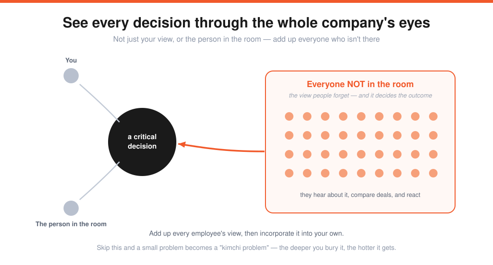
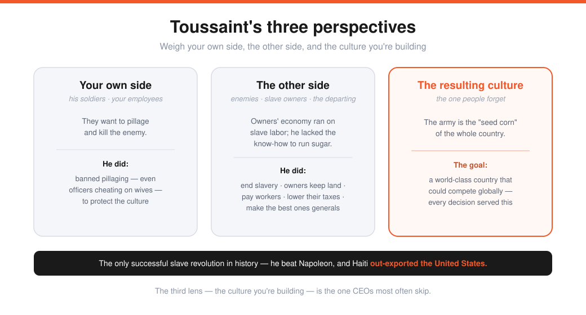

# Ben Horowitz — How to Manage (Lecture 15)

> Source: Stanford CS183B, Lecture 15 (Nov 11, 2014). Ben Horowitz (co-founder Andreessen Horowitz; author of *The Hard Thing About Hard Things*).
> Transcript: https://genius.com/B-horowitz-lecture-15-how-to-manage-annotated
> The judgment layer over [How to Operate](14-how-to-operate-keith-rabois.md).

Ben "wrote a 300-page book on management" but teaches **exactly one concept** here — the one CEOs mess up most, from tiny to huge:

> When you make a critical decision, **understand how it will be interpreted from every point of view** — not just yours, not just the person you're talking to, but **everyone who isn't in the room.** Add up every employee's view, then incorporate it into your own. Otherwise your decisions have weird side effects and dangerous consequences. It's hard *because* you're under pressure when you decide.

---

## Case 1 — demote or fire an executive?
A great guy: works hardest, well-liked, doing everything right — but **in over his head** (lacks the knowledge/skills to compete). Demotion *seems* win/win: keep his work ethic and friends, slot someone above him, "we value our employees." From his side, demotion beats firing (easier to explain to the next employer).

**But ask: what's his equity?** He has **1.5%** (VP-level). The engineers have 0.1–0.2%. How will they feel about a *non*-Head-of-Sales holding 1.5%? Do you claw it back (and kill his productivity)? Will anyone respect a demoted boss? ("You got demoted — who are you to tell me what to do?")

> The real decision isn't about one person. It's: **what does it mean to fail on the job — especially the highest-equity job — and what's required to keep your equity: effort, or results?** The answer differs by level and situation, but you must know what it means to *everybody.*

---

## Case 2 — an excellent employee asks for a raise
Surface instinct: they're good, they asked for a reason, retain them, be fair → give it → all love (the "Shmoney Dance"). **But** consider the employee who *didn't* ask — who may be doing *better* work:

> "I didn't ask and didn't get one; they asked and got one. So you don't evaluate performance — whoever asks, gets. I either become the asker (which isn't me) or I quit for a company that actually evaluates performance."

Raises aren't confidential. The cultural result: everyone feels a "fiduciary duty to their family" to **ask constantly** — you've *encouraged* raise-asking.

**The right answer is to be formal — process protects the culture.** Anyone can come tell their story (you won't decide on the spot); you gather coworker input, evaluate the work, and decide **on a cycle** (every quarter or six months) — never off-cycle, never just because someone asked. ("Lobby all you want — I already ran my process.") It also *reduces* anxiety: people stop worrying they're being aced out for not being buddy-buddy.

---

## Case 3 — should every startup grant 10-year option exercise windows?
The problem (from Sam's blog post): employees get ~**90 days** after leaving to exercise vested options, which costs cash (strike + tax) they often don't have — so they must choose between **forfeiting vested money** or **staying for the wrong reasons.** Brutal when you're *fired.* (At an Airbnb/Uber, options "worth $10M" might cost $2.5M to exercise in 90 days — or they vanish.) Adam D'Angelo's fix: make options exercisable for **10 years.**

> **Ben's move: ask why the 90-day rule survived 30 years.** Something changed — pre-2004 accounting rule **APB 25** (people went to *jail* over it) made a long exercise window an unpredictable, stock-price-linked expense, so you could never forecast earnings or go public. Now it's gone, so it's right to question the rule.

Weigh all perspectives: you want to be fair (don't fire someone *and* take their money → reputation risk); forfeited options return to the pool (less dilution); losing stock is a retention incentive (good, or golden handcuffs that keep the *wrong* people); and a 10-year option on volatile startup stock is genuinely *valuable* — which the staying employee doesn't get. **Reevaluate — don't blindly adopt.** Two honest cultural statements:
1. "We're straightforward and fair → you get 10 years, regardless of your wealth."
2. (Almost no one says this) "Salary is guaranteed, but for your stock to matter you must vest, **stay until exit**, and the company must be worth something — because we *value people who stay.* Don't join if you'll leave in 18 months." *(Sam revised toward more incentive to stay; and note: if you have the money, you don't get screwed.)*

---

## Case 4 — Toussaint Louverture and the three perspectives

Born a slave in the brutal sugar colony of Saint-Domingue (Haiti), Toussaint's threefold vision: **end slavery, run the country, and make it world-class.** His mastery was weighing **three perspectives** on every decision — his own side, the enemy, and *the resulting culture* (his army was "the seed corn" of the nation):

- **Conquering the enemy:** his soldiers wanted to pillage and kill; he **banned pillaging** (and even officers cheating on their wives) because he cared about the resulting culture — his army's restraint stunned even the enemy. When he beat the British/Spanish/French, he made **their best people his generals** (for their expertise and a higher-level culture).
- **What to do with slave owners?** His slaves wanted them dead — but he needed the sugar economy and lacked the know-how/trade ties; the owners' cost structure depended on slave labor. Solution: **end slavery, let owners keep their land, make them pay workers — and lower their taxes** to fund it, all in service of a stronger culture.

**Results:** the **only successful slave revolution in history**; owners kept their land; he defeated Napoleon; and Haiti had **more export revenue than the United States.** The power of seeing a situation from *all* constituents' eyes — even the people you hate.

---

## Conclusion & sharp Q&A
> Discipline yourself to see your company through the eyes of your employees, your partners, and **the people who aren't in the room.**

- **Firing/demoting conversation:** it's a *hiring/integration failure* — be honest ("here's what I didn't recognize about us and you"), not "you suck" and not the mushy "it's not you, it's me." When telling the company: **take their job, not their dignity** (Bill Campbell) — thank them, skip the personal details. What you say *is their reputation* (everyone will be a reference).
- **Converting an enemy:** show them a *better way* — your culture, mission, and way of doing things must be genuinely elevated.
- **Putting yourself in others' shoes → pause.** If something's important and you haven't thought it through: "I'm taking this seriously, but I need to think it through from all perspectives — I'll come back." Don't sneak a raise "under the covers" — it becomes a **"kimchi problem": the deeper you bury it, the hotter it gets.** (Bill Campbell's elite skill was seeing the company through employees' eyes.)

---

## My action items
- [ ] **Whole company:** For my next hard call, what does it mean to the people *not* in the room?
- [ ] **Raises/equity:** Do I have a *formal, on-cycle* process — or am I rewarding whoever asks loudest?
- [ ] **Question old rules:** Before adopting (or keeping) a policy, do I know *why* it exists?
- [ ] **Three perspectives:** Have I weighed my side, the other side, *and* the resulting culture?
- [ ] **Pause + dignity:** Am I pausing on big calls, and protecting people's reputation on the way out?
