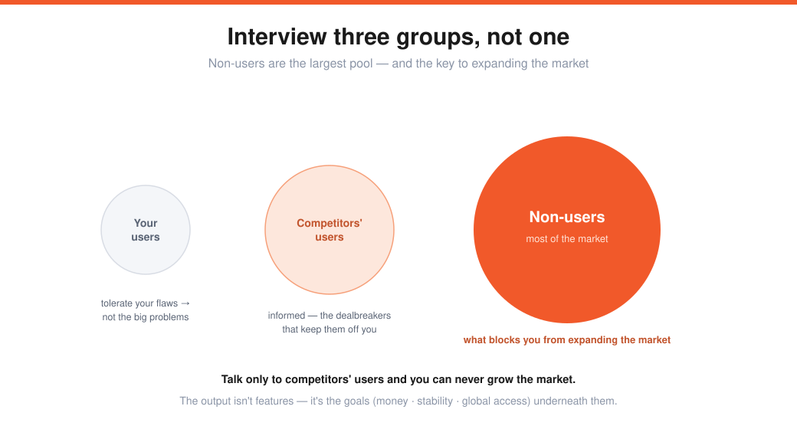

# Emmett Shear — How to Run a User Interview (Lecture 16)

> Source: Stanford CS183B, Lecture 16 (Nov 13, 2014). Emmett Shear (co-founder/CEO, Twitch).
> Transcript: https://genius.com/Emmett-shear-lecture-16-how-to-run-a-user-interview-annotated
> The "talk to users" craft behind [Building Product & Growing](04-product-users-growth-adora-cheung.md) and [Products Users Love (I)](07-products-users-love-kevin-hale.md).

Emmett's first startup (Kiko, a calendar) failed partly because **neither founder used calendars and they never talked to anyone who did.** Justin.tv worked by "cheating" — they built it *for themselves* (a way to skip talking to users, but limiting). The pivot to **gaming** finally forced real user interviews, and that data drove three years of Twitch product — they built a whole **division** to talk to users.

> **Who you talk to is as important as what you ask.** Twitch focused on **broadcasters** (content drives viewers — talking to viewers would have given totally different feedback). There's no recipe for picking the target user; it's judgment.

---

## Step 1 — who is your user, and where do you find them?
For the demo idea (a lecture note-taking app), the obvious user is **college students** — but they barely spend money. So you also need the people *critical to success but not obvious*: **college IT / administrators** (who actually buy software) and **parents** (who pay for a freshman's productivity). At the very beginning, cast the **broadest** net — don't talk to just one type of person.

---

## Running the interview — ask about behavior, not features
In the live demo (Stephanie), Emmett asked only about **current behavior**: *How do you take notes today? What software? Do you actually review them? Why two tools at once?* — and never once discussed the app's features.

> **Stay away from features.** Users think they know what they want — the "horseless carriage" effect (they ask for a *faster horse*, not a car). A real user asking for a feature feels overwhelmingly real and is hard to refuse — so instead, talk to lots of people and sense the underlying *problems.*

- **Read the signal:** Stephanie had no big blockers → maybe not a big enough problem (a negative sign — but keep going).
- **~6–8 people and you're usually done** — and deliberately talk to **extremes** (6 Stanford students ≠ 6 high-schoolers ≠ 6 parents).

### From insight → idea → validation
Turn behavior into an idea ("if you built *one* feature on top of Google Docs, what would make it a quantum better?"). Then validate — but **never ask "is this feature good?" / "are you excited?"** (they'll say "great," then never switch). Instead:
- **Just build & ship it** (if you're fast) — but the "one little thing" might take 3 months, so often…
- **Hack/cheat** something in front of people (a browser extension stuffing in the feature), or
- **Use the money test** — *sales is the cure-all.* A credit card up front is the most validating thing there is: **"if you're not five dollars excited, you're probably not very excited."**

---

## The three groups Twitch interviewed

| Group | What they asked for | What it really means |
|---|---|---|
| **Your own users** (12–14 JTV broadcasters) | clear the ban list, editable highlight titles, polls | They *already tolerate* your flaws → **probably not the biggest problems.** |
| **Competitors' users** | multi-person channels, **revshare/money**, **video stability** (esp. Europe) | Informed (tried all 4 services) → the dealbreakers **so bad they won't even use you.** |
| **Non-users** (neither you nor competitors) | "my computer's too slow," "I make polished YouTube videos," Korea: "broadcasting practice reveals our strategy" | **The largest pool, and the most important** → what blocks you from *expanding the market.* |

> If you only talk to your competitors' users, you can never *expand* — you need the non-users to grow the market. (Twitch's response: brought people computers, partnered with broadcast-software makers, and built broadcasting into Xbox and PS4.)

### The output is goals, not features
The interviews didn't yield a feature list — they revealed **goals**: people wanted **money, stability/quality, and universal global access.** Twitch **poured resources into things no one ever mentioned in an interview** (the things that actually solved those problems), then went back to the *same* interviewees — *"you said you cared about making money; here's a subscription program."* Most had **never** experienced being heard, so they became the first converts. (They picked **representative** broadcasters — big, medium, small.)

Contrast with Justin.tv, which mined Google Analytics / Mixpanel endlessly — data tells you *how* people use it and *where* they drop off, but **not what problem to solve.** Ideas invented without talking to users were bad **9 times out of 10.**

> The sad truth: interviews mostly deliver **negative news about your favorite feature** — which is why people avoid them. But better sad now than four months after launching something no one wants.

---

## Sharp Q&A nuggets
- **Biggest mistakes:** (1) **showing people your product** (learn what's already in their heads — don't put things there); (2) asking about your **pet feature** ("would you pay for a subscription?"); (3) **talking to who's available** instead of who you *need* (forum users are easy but not the best data — Twitch spent weeks tracking down the right non-messageable users). People are flattered to be asked.
- **Get company buy-in by recording interviews and replaying them** — "it's like magic." (Recording also frees you from disruptive note-taking.)
- **Skype/in-person ≫ email** (email interviews are "basically useless" — non-interactive). The gold is **"Interesting — tell me more"** → **detective mode**; people fill silence. (Ask consent to record.)
- **International is hard** — fluent-English speakers abroad aren't representative; it's why companies build in their home market first.
- **Channels:** onsite messaging ("I was watching your stream…") and events (get to know them, swap cards, follow up — don't interview *at* the event). **Don't compensate** — if they don't care enough to talk to someone solving their problem, wrong tree.
- **Usability tests ≠ interviews.** Watching someone use a built thing tells you where you went wrong *building* it, not **what to build** — that's the data-driven layer. Early-stage interviews are the crucial part.
- **Start with competitors' users** when resources are tight — they already want the behavior, so you only have to convince them to *switch* (easier than creating new behavior, and it bought quick wins).
- **The pool shifts over time** — the people who get you started aren't who's using it in three years (Twitch later interviews game publishers). Keep doing it; don't stop after early success.
- **To give good feedback as a user: ramble** — the more they learn about you as a person and your context, the easier it is to understand *why* you want what you want.

---

## My action items
- [ ] **Who:** Have I listed my user *and* the people who pay/gate-keep — and the extremes?
- [ ] **Behavior not features:** Am I asking how they do it today, or pitching my feature?
- [ ] **Three groups:** Have I talked to my users, competitors' users, *and* non-users?
- [ ] **Goals:** What underlying goal (not feature) keeps coming up — and am I building for *that*?
- [ ] **Validate:** Can I hack a test or get a $5 commitment instead of asking "is this good?"
