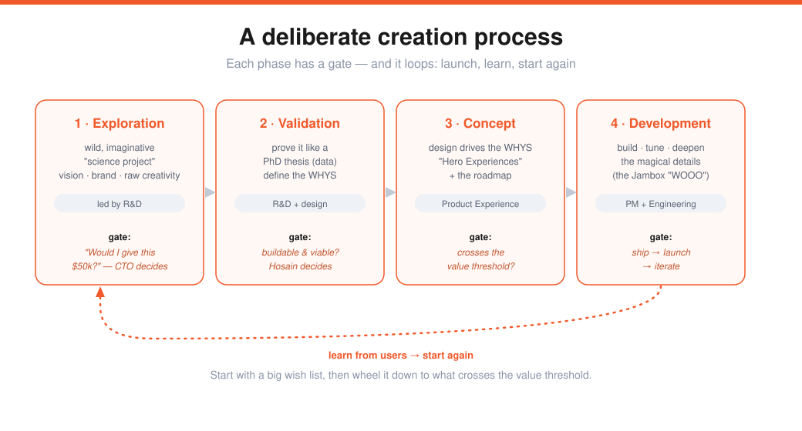
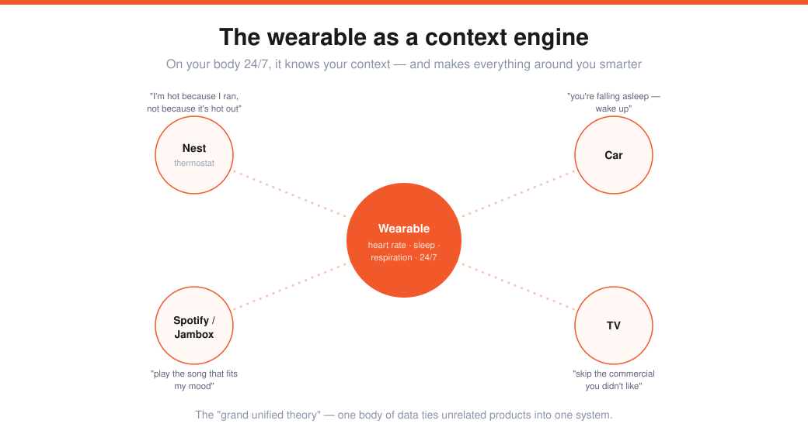

# Hosain Rahman — Building Products Users Love, Part II (Lecture 17)

> Source: Stanford CS183B, Lecture 17 (2014). Hosain Rahman (co-founder/CEO, Jawbone).
> Transcript: https://genius.com/Hosain-rahman-lecture-17-how-to-build-products-users-love-part-ii-annotated
> The hardware companion to [[07-products-users-love-kevin-hale]] and [[16-how-to-run-a-user-interview-emmett-shear]].

Jawbone lives at the intersection of **engineering and beauty** — and was building the "Internet of Things" before the term existed (headset → wearable computer → the Jambox wireless speaker → the Up health band).

> **IoT is a mess** — everything is "smart" and has an app, but nothing talks to each other. It needs an **organizing principle**, and the shift is from *things* to the *individual user.* A wearable on your body 24/7 becomes a **context engine** for everything around you.

---

## The full stack: hardware × software × data
To deliver that vision you must be great at **all three — "three equal stools."** Hardware has to be worn 24/7 or the whole service is "a castle in the air." Combining the disciplines caused real friction (software iterates fast; hardware is deliberate — 16-week tooling), and the synthesis went both ways: **hardware learned to move faster, software learned to resolve experiences before shipping**, and data science informs both.

> **Everything is a system.** Not discrete hardware, app, or platform — think across the whole spectrum (on-body sensors → phone → cloud insight → a developer platform of thousands of apps).

---

## The creation process

A deliberate, staged pipeline with a gate at each step:

| Phase | What happens | Who leads | The gate |
|---|---|---|---|
| **Exploration** | wild, imaginative "science project" — vision, brand, disruption, raw creativity (demo Fridays, hackathons) | R&D (product/eng take a back seat; execs are a "signing board") | *"Would I give this person $50k?"* — CTO decides |
| **Validation** | prove it like a **PhD thesis** (empirical data); define the **WHYS**; assess buildability, cost, timing | R&D + industrial design + product experience | is it buildable & viable? — Hosain decides |
| **Concept** | the **Product Experience** team (one unified design org) drives the WHYS, defines **"Hero Experiences,"** and the roadmap | Product Experience → Product Managers | does it cross the **value threshold**? |
| **Development** | engineering signs off on the build/schedule; deepen engagement, tuning, the **magical details** | Product Management + Engineering | ship → launch → **iterate** |

Then it loops back to exploration. The magical details matter: the Jambox "WOOO" took **months** of audio tuning; the rubber came from the one manufacturer who could hit the spec; Up's sleep-graph animations were deliberate.

---

## The WHYS framework
Where Hosain spends his time. The WHYS articulate the **problem you solve**, become themes → actionable concepts, and are owned by cross-functional **pods** (one each from product experience, hardware eng, software eng, data). The core question:

> **"What user problem do we solve such that, once solved, people can't live without it?"** — either a burning unmet need, or something you never knew you needed.

**Category strategy = human problem + "what's in it for us":**
- *Human problem (why the category should exist):* content lives in your phone now → it needs **portable, high-quality, seamless-across-time-and-space** audio. (That was the Jambox.)
- *What's in it for Jawbone:* speakers are the **entry into the home** (media is the killer app in the house) — millions of units and a foundation for home software/services. **Both must go together** — you're not a philanthropy, and success funds the next products.

And the **experience continuum**: where the product is today (a Bluetooth speaker) vs. where it's going — build today as a *stepping stone* that graduates users forward, which guides tradeoffs ("not in this product, but there's space in the next").

---

## The context engine — the grand unified theory

> Because the band is on you 24/7 (heart rate, sleep, respiration), it knows your **context** — and can make everything else smarter. Tell the Nest you're hot *because you ran* (not because it's hot out); tell the car you're falling asleep; tell Spotify/Jambox what to play; tell the TV to skip a commercial; *"don't watch Game of Thrones on a Sunday night because you don't sleep well."*

That's why Jawbone is an **experiences company**, not a hardware/software/data company — it's the *system* and how the pieces come together. The WHYS become the problem statement, and you decide the **right distribution across the system**: hardware? cloud service? app? a sound? a button? — where to attack and where to innovate. The bar is **emotional connection** ("without it you're lost — I'll go home to get it").

---

## User research done right
*(Sam's question: nobody would say they'd pay $200 for a wireless speaker.)*

When the Jambox launched (fall 2010), wireless speakers were **0%** of the speaker market; by Christmas 2013, **78%.** Ask "who wants a $199 phone speaker?" and 0% say yes — yet it transformed the industry. The fix is to **ask about behavior, not validation:**
- Not "do you want a digital music player?" but *"how much music do you listen to with other people, and how do you play it?"*
- The iPod pitch was *"1,000 songs in your pocket,"* not "a portable digital music player."

> Separate **questions that make *you* smarter about your thesis** from **trying to get someone to validate it.** "No one's going to tell you what to build — if they could, they'd do it." *(Same lesson as [[16-how-to-run-a-user-interview-emmett-shear]].)*

---

## Track → Understand → Act (wearable health)
The narrative for everything in Up: we know everything about the *world* (Twitter, Google) but **nothing about ourselves.** So:
1. **Track** — design hardware people actually keep on (battery, materials, how it latches → the *habit*).
2. **Understand** — raw data isn't enough ("your heart rate is 75" — good or bad? depends). **Contextualize** it into knowledge.
3. **Act** — the key. "When I work out at 4pm I get 4 more hours of deep sleep → remind me at 4pm to work out."

Design **different experiences for different users** (weight-loss, social, vanity, medical); treat **notifications as a tool for behavior change**; storyboard per user type. And **constraints are good** — they force you to simplify and find the simplest answer to the problem.

---

## Sharp Q&A nuggets
- **System tradeoffs:** don't silo — **put everyone in a room** and have each person share their pains ("if you constrain me this way, I can't hit the quality spec"); hash out how one tradeoff ripples across the whole system. (UP3's new sensing system took daily 3-hour calls.) When you're small it's easy — you sit around a table.
- **"A system is a mindset,"** not literally a system. Everything has one (an app = storage + front-end + connection); the point is thinking about how tradeoffs work across the pieces.
- **Unrelated products?** A **grand unified theory** (the context engine) ties them together — and you build the *building blocks*: credibility, distribution, manufacturing scale.

---

## My action items
- [ ] **WHY:** Can I state the one user problem that, once solved, makes people unable to live without it?
- [ ] **Human problem + what's in it for us:** Does my category serve a real human need *and* build toward my advantage?
- [ ] **System, not feature:** Where across the system (hardware/service/app/detail) should I solve this?
- [ ] **Behavior questions:** Am I asking how people live, not "would you pay for this?"
- [ ] **Track→Understand→Act:** Am I turning data into understanding into a concrete action?
