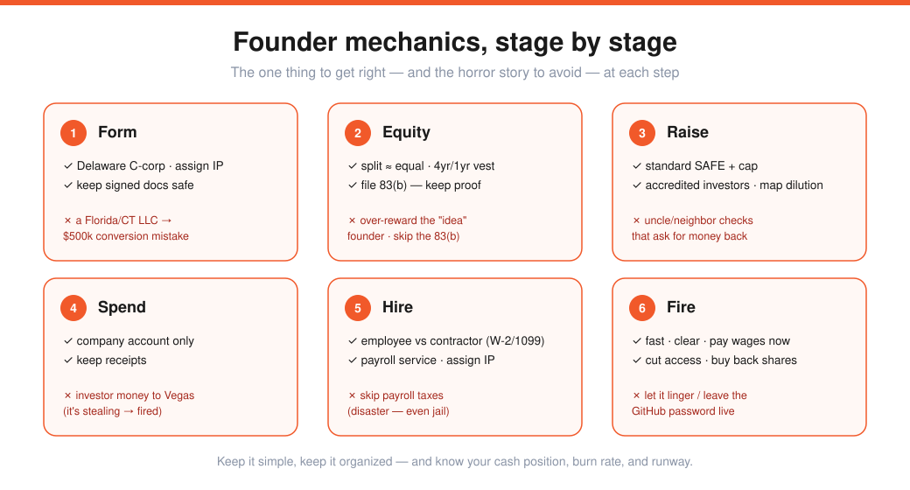
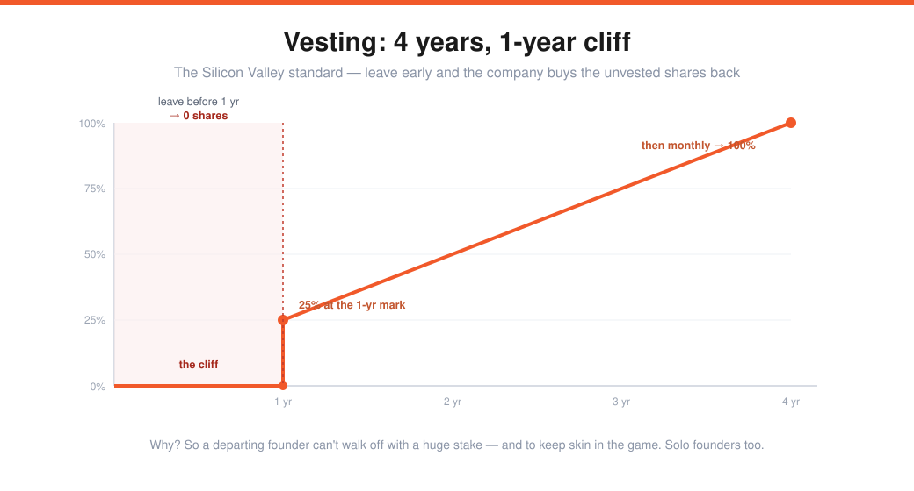

# Mechanics — Legal, Finance, HR (Lecture 18)

> Source: Stanford CS183B, Lecture 18 (Nov 20, 2014). Kirsty Nathoo (CFO/accountant, YC) & Carolynn Levy (lawyer, YC).
> Transcript: https://genius.com/Kirsty-nathoo-lecture-18-mechanics-legal-finance-hr-etc-annotated
> Tools mentioned: Clerky (incorporation/financing docs), ZenPayroll, inDinero. The plumbing under [How to Raise Money](09-how-to-raise-money.md).

Founders don't need the mechanics in *detail* (don't get bogged down) — but knowing the **basics** lets you avoid pain, stop worrying, and focus on the company. The whole talk's minimum bar: **don't form your startup as a Florida LLC.**

---

## Formation
A startup is a **separate legal entity** — its primary purpose is to **shield you from personal liability** (if it's sued, it's the corporation's money at risk, not yours).

- **Incorporate in Delaware.** Clear, settled law; investors are comfortable with it → less diligence, no "reincorporate to Delaware" conversation. **Keep it simple and familiar — don't get fancy.** (A YC company formed as a Connecticut LLC, converted wrong, and the mistake surfaced mid-raise → **$500k** bill across four law firms.)
- **Setup steps:** fax 2 pages to Delaware (creates a shell) → bylaws, board, officers (Delaware requires **CEO, President, Secretary**) → **IP-assignment docs** so the company owns your inventions/code. Always hold the **individual-vs-company split** in your head.
- **Keep the signed documents safe and organized** — you'll need them at the most stressful moments (Series A, acquisition due diligence).

---

## Equity allocation
- **Execution > idea.** Ideas have ~zero value (nobody pays a billion for an idea) — resist over-rewarding the "idea" founder.
- **Split roughly equally.** A very disproportionate split is a **red flag** that founders aren't in sync. *In the top YC companies, there are zero instances of a significantly disproportionate split.* If everyone's in 100% for the long haul, what happened *before* formation shouldn't matter.
- **Stock doesn't buy itself.** Sign a **Stock Purchase Agreement** (buy your shares for cash or by contributing IP). The stock is **restricted** (vests over time).
- **File the 83(b) election** — within 30 days, and **keep proof you sent it.** It can't be fixed later; without proof it vanishes into an IRS black hole and **investors/acquirers will walk.**

## Vesting

You own your shares but the company can **repurchase the unvested ones** (at the price you paid) if you leave early. The Silicon Valley standard: **4 years with a 1-year cliff** — 0% until the 1-year mark, then 25% vests at once, then monthly over the next three years.

> **Why vest your own shares?** (1) so a departing founder doesn't walk off with a huge chunk of equity; (2) **skin in the game** — incentive to keep grinding. Solo founders need it too (skin in the game, *and* it sets the culture/example for employees). Investors won't fund a company where founders can quit and keep a big stake.

---

## Raising money — the paperwork
Two ways: **price set** (a priced **Series A/B**) or **price not set** (a **seed**, via a convertible note or **SAFE**). Unpriced is the fastest, simplest route.

- A **SAFE** = the investor pays $X now and gets stock later when the price is set; they are **not yet a shareholder** (no voting rights).
- The **valuation cap** is their reward for being early — an upper bound on the conversion valuation. ($100k on a $5M cap; a later $20M priced round → their price per share is ~¼ → ~**4× more shares** than a Series A investor.)
- **Understand future dilution.** $2M of SAFEs at a $6M cap convert to ~**25%**; add ~20% for the Series A → you've already given away ~**45%.** (Some money at a low cap still beats no money — just track where it leads.)
- **Raise from accredited/sophisticated investors** — avoid the uncle/neighbor $5–10k checks who later want their money back.

### Four common investor requests
| Request | What to do |
|---|---|
| **Board seat** | Usually **say no** — only yes if they genuinely add strategy/value (money is valuable; direction is priceless). |
| **Adviser shares** | No — an investor is a *de facto* adviser with **no title and no extra equity** (the NBA-player-wants-stock-to-make-intros story = a freebie grab). |
| **Pro-rata rights** | Common and not bad (lets them maintain %), but know that **founders suffer greater dilution** as the corollary. |
| **Information rights** | Periodic updates are good (YC encourages **monthly** ones); push back on overreach (weekly updates, monthly budgets). |

> Just because you agreed on valuation doesn't mean the other terms don't matter — **the burden is on you to understand everything you sign.**

---

## Spending money
Business expenses (payroll, rent, hosting, CAC) are **deductible**; non-business expenses aren't. Maintain the separation — the **company account pays company expenses** (you wouldn't buy a toothbrush on a Google card). Investor money **isn't yours** (the founder who took investor money to Vegas → fired; it's stealing). The test: *"if I gave investors a line-by-line breakdown, would I be embarrassed by any line?"* **Keep receipts** for the bookkeeper/CPA.

---

## People
**Founder employment:** founders are employees, and **working for free is illegal** → pay at least **minimum wage** (not lavish — stay lean), and **pay payroll taxes** (a YC company skipped them for 3 years → disaster; in extreme cases, jail). Use a payroll service.

> **Founder break-ups get ugly when founders weren't paid** — unpaid wages become *leverage* for the fired founder to demand vesting acceleration. Pay yourselves; treat co-founder wages like a **marital pre-nup.**

**Hiring — employee vs. contractor** (the IRS cares; fines if you misclassify):

| | Contractor | Employee |
|---|---|---|
| Hours/location/equipment | their own; project-based | company directs |
| Tax withholding | none — they handle it | **company withholds & remits** |
| Year-end form | **1099** | **W-2** |
| IP assignment | **required** | **required** |

Pay ≥ minimum wage (SF ≈ $2,000/month), carry **workers' comp insurance** (NY is aggressive), verify **work authorization**, and **use a payroll service** (ZenPayroll).

**Firing — "you're not a real founder until you've fired someone."** Best practices:
1. **Fire quickly** — a toxic employee left lingering makes good employees quit.
2. **Communicate clearly** — direct, face-to-face, with a third party; no apologizing or rationalizing.
3. **Pay all wages + accrued vacation immediately** (legal requirement).
4. **Cut off digital & physical access** (the co-founder who held the GitHub password hostage).
5. **Repurchase any vested shares** right away.

---

## Closing & Q&A
- **Know your key metrics:** cash position, burn rate, and *when the cash runs out* (so you can talk to investors in time). If the company doesn't own its **IP**, it has no value.
- **Bookkeeper vs CPA:** a bookkeeper categorizes expenses; a **CPA** files the annual tax return (you'll need one within year one — services like inDinero). Find specialists **through recommendations**, and use people **experienced with startups** (not your aunt in Minnesota).
- **Budget:** incorporating via Clerky costs **hundreds, not thousands** (no lawyer needed); standard fundraising docs can be **<$100**. Hire a lawyer only when complexity (HIPAA, unusual seed terms) demands it.

---

## My action items
- [ ] **Form right:** Delaware C-corp, IP assigned, signed docs stored safely.
- [ ] **Equity:** roughly equal split, Stock Purchase Agreement signed, **83(b) filed with proof.**
- [ ] **Vesting:** 4 years / 1-year cliff on every founder — including solo.
- [ ] **Raise clean:** standard SAFE + cap, accredited investors, dilution mapped.
- [ ] **People & money:** payroll service running, company account only, IP assigned by every hire.
