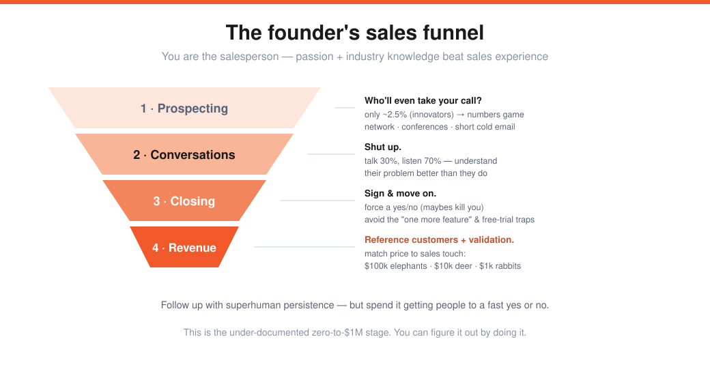
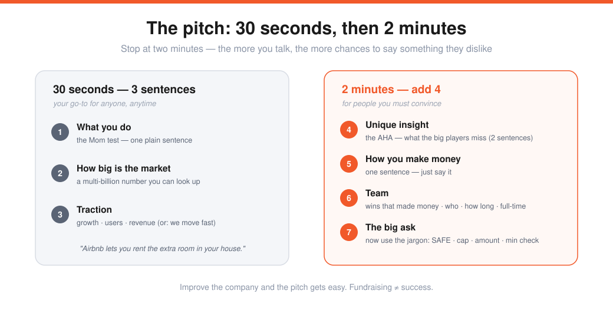

# Sales, How to Pitch & Investor Roleplaying (Lecture 19)

> Source: Stanford CS183B, Lecture 19 (2014). Tyler Bosmeny (CEO, Clever) on sales; Michael Seibel, Qasar Younis & Dalton Caldwell (YC) on pitching.
> Transcript: https://genius.com/Tyler-bosmeny-lecture-19-sales-and-marketing-how-to-pitch-and-investor-meeting-roleplaying-annotated
> The go-to-market + fundraising craft on top of [Don't Scale & PR](08-dont-scale-and-pr.md) and [How to Raise Money](09-how-to-raise-money.md).

---

## Part 1 — Sales (Tyler Bosmeny)
The myth: sales is charming Don Drapers with killer closing lines. The reality: **as a founder, *you* are the salesperson.** (PG: you're always either building or talking to users — and *talking to users is selling*.) Your **passion** and **industry/problem knowledge** trump sales experience. Dedicate one founder to it full-time.

### Prospecting — who'll even take your call?
On the **technology adoption curve** (Everett Rogers), only the **~2.5% innovators** will consider a startup with no users and no revenue — which makes early sales a **numbers game.** (Tyler reached **400+ companies** in his first two months of YC.) Three channels:
- **Personal network** (obvious).
- **Conferences** — go where your users are (even a CIO gathering at a Milwaukee hotel). Get the attendee list in advance, email everyone, book meetings so every minute counts.
- **Cold email** — keep it *short*: who I am, what I'm building, can we talk tomorrow?

### Conversations — **shut up**
> If you take away one thing: **when you get them on the phone, shut up.** The top 1% of salespeople talk ~**30%** and listen ~**70%** — asking *"Why did you agree to take my call?" "How do you solve this today?" "What would your ideal solution look like?"* Understand their problem better than they do.

### Follow up — but force a yes/no
Have a **superhuman, unreasonable willingness to follow up** (the second Clever deal took ~60 steps — and the buyer *still* ignored emails). But your time is your only resource, so **push for a yes or no fast** — *maybes are what kill you*; a **no beats a maybe** because you can move on.

### Closing — and the traps
**Redline** the agreement and sign (YC open-sourced its standard deal docs). Don't do ten rounds over pride/indemnification — remember the goal is **reference customers, validation, revenue.** Two traps:
- **"Just one more feature"** ≈ a **pass** (9 times out of 10 there'll be another reason). Either put it *in the signed agreement*, or wait until *many* customers ask for it.
- **The free-trial trap** — trials give you no revenue/validation/commitment, and you have to re-sell at the end. Instead: *"We don't do free trials — an annual agreement with a 30–60 day opt-out."*

### Scale & pricing buckets (Christoph Janz — "5 ways to $100M")
1,000 × **$100k** (elephants — high-touch sales: Salesforce, Workday) · 10,000 × **$10k** (deer) · 100,000 × **$1k** (rabbits — must be **low-touch/scalable**). **Match your sales process to your price** — if you sell a $1k product with flights, eight demos, and three months of redlining, rethink something.

---

## Part 2 — How to pitch (Michael Seibel)
> The best way to improve your pitch is to **improve your company.** With traction, these conversations get easy — investors *want* you to succeed.

### The 30-second pitch — three sentences
1. **What your company does** — the **Mom test**: one sentence your mom understands, in plain language. *"Airbnb lets you rent out the extra room in your house,"* not *"a marketplace for space."*
2. **How big is the market** — a multi-billion-dollar number you can look up.
3. **Traction** — growth %, users, revenue. (Pre-launch? Show you move *fast*: "started in January, beta in March, launched in April.")

### The 2-minute pitch — add four things (then **stop**)
> Don't do 10- or 30-minute pitches — *"the more you talk, the more chances to say something they don't like."*

- **Unique insight** — the **AHA**: something the big players don't know or do well, in *two sentences*. (Watch their face — "uh" = nailed it; "I knew that" = missed.)
- **How you make money** — *one sentence*; just say it ("advertising"). Listing every possible model says you have no idea.
- **Team** — lead with wins that *made investors money*; otherwise: # founders (2–4), % technical (≥50%), how long you've known each other (≥6 months), full-time, how you met.
- **The big ask** — *now* use the jargon: note/SAFE, the cap, the amount, the minimum check size. Not knowing these reads as "not serious."

### When to fundraise — flip the power dynamic
Investors invest on **traction**, so engineer a situation where **you're strong and they're weak.** You're strong if: investors are *asking* to give you money; you're getting the word out; and you've planned to **launch and grow without needing much money** (never "we can't do anything until you fund us"). Pre-traction edge: a **fully committed, full-time team moving fast** (8 months of work in 1–2).

### Setting up meetings
- **Warm intro** from an entrepreneur or a previous investor (an investor who passed *but offers to intro* is "kryptonite"). The introducer's credibility matters — don't cold-call.
- **Think in parallel — it's a sprint, not a marathon.** Pack all meetings into one week. (Trick: "we're heads-down building for two weeks — can we meet in week 3?" → packs the calendar *and* signals you're not desperate.)
- **One team member fundraises full-time** — don't let it consume the company.

### The roleplay — bad vs. good pitch
| Bad | Good |
|---|---|
| vague "communication platform"; name-drops WhatsApp/Snapchat | concrete narrative: *"message a location"* (puke in the aisle, "where's the shampoo?") |
| evasive on numbers ("we're stealth") | clear traction: **350 businesses, 11% weekly growth**, sold by the founders themselves |
| no insight, no narrative | a real insight: **>half the messages are questions, not feedback** |
| never asks for money; lets it flail | **asks**: $500k on an $8.5M note, $250k committed by named investors, *closing Friday* (deal heat) |

### After the meeting
**Follow up.** Anything other than a check or wired funds is a **no.** Create **deal heat** (demand to be in the round) to drive the price; **do diligence on your investors** (you're selling part of your company — know who's buying); and **know when to stop** — some founders fundraise forever because it's easier than building.

> **Fundraising ≠ success.** People equate raising with success because it feels like "another application to check off." Building a company is far more ambiguous.

---

## My action items
- [ ] **I'm the salesperson:** Am I personally prospecting (network · conferences · cold email) and treating it as a numbers game?
- [ ] **Shut up:** On calls, am I listening ~70% and forcing a yes/no instead of collecting maybes?
- [ ] **Traps:** Am I avoiding "one more feature" and free trials — signing for revenue and moving on?
- [ ] **30-second pitch:** Can my mom understand sentence one? Do I have market + traction ready?
- [ ] **Fundraise strong:** Warm intros, all meetings in one week, a clear ask — and improving the *company*, not the pitch.
