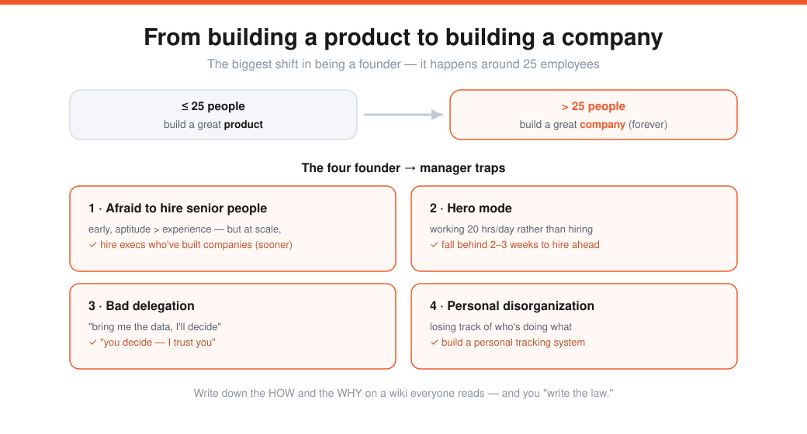
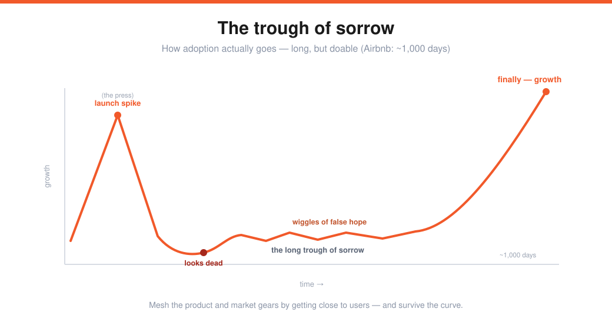

# Sam Altman — Closing Thoughts & Later-Stage Advice (Lecture 20)

> Source: Stanford CS183B, Lecture 20 (2014). Sam Altman.
> Transcript: https://genius.com/Sam-altman-lecture-20-closing-thoughts-and-later-stage-advice-annotated
> The capstone — what to do *after* the rest of the course works. Bookends [[01-four-pillars-sam-altman]].

Everything else in this course was about the beginning. This lecture is the list of things you can **ignore until after product-market fit** (mostly **months 12–24**) — and that founders most often fail to transition on. *Write these down and look back when you get there.*

> **The biggest shift in being a founder:** before PMF, your #1 job is to build a great **product.** Past ~25 employees, it becomes building a great **company** — and stays there for the rest of your time.

---

## Management
Early on there's **no structure** (everyone reports to the founder) — and that's *optimal* below ~20–25 people. But **lack of structure fails all at once** (fine at 20, disastrous at 30). The fix is simple, not complex: **every employee has exactly one manager**, and everyone knows the reporting structure. Don't innovate on management structure (innovate on product) — and don't build convoluted matrix orgs.

### The four founder → manager failure cases
1. **Afraid to hire senior people.** Early, hire get-stuff-done people (aptitude > experience). At scale, **experienced execs** who've built companies are gold — founders always wish they'd hired them sooner.
2. **Hero mode.** Leading by example to the extreme (working 18→20 hrs on support tickets, refusing to stop and hire). The fix: deliberately **fall behind for 2–3 weeks** to hire *ahead* of the growth curve.
3. **Bad delegation.** "Research it, bring me the tradeoffs, *I'll* decide, you implement" doesn't scale. Better: *"you're smart — here's what I think, but **you** decide, I trust you."* (Jobs got away with the former; 99.9% of people should do the latter.)
4. **Personal disorganization.** Get a system to track what you — and everyone else — owe and need follow-up on.

> **Write down the HOW and the WHY.** Put how-we-do-things and the cultural *why* on a wiki everyone reads → as founder you "write the law." Otherwise it's random oral transmission. One of the highest-leverage things founders skip.

---

## HR — it speeds you up
| Area | What to put in place |
|---|---|
| **Structure + career path** | clear, simple |
| **Performance feedback** | frequent, simple — people must know how they're doing |
| **Compensation bands** | ranges per level; keeps it fair (everyone learns comp someday) and cuts negotiation |
| **Equity** | keep giving *a lot* (~3–5%/yr) with **refresher grants**; stay ahead of vesting; get an **option-management system** (not Excel) |
| **~50 employees** | new legal rules kick in (harassment & diversity training) |
| **Burnout** | post-PMF it's a marathon — vacations, new challenges; whole-company burnout can end a company |
| **Hiring process** | a full-time recruiter once things work; **announce offers internally** first; onboarding + a buddy |

> Investors give **bad advice** on employee equity (short-sighted about dilution) — but the most successful companies give out a lot of stock, year after year. And handle **diversity** early (don't let the first 15–20 hires become a monoculture), and be proactive about your **early employees' career paths** as bigger roles appear above them.

---

## Company productivity
Small teams are naturally productive; productivity drops **with the square of headcount** (every pair of people adds communication overhead) unless you build systems at 25–50 people.

- **Alignment is the word that matters most** — a clear roadmap and goals everyone knows. *The test:* pull 10 random employees and ask the top 3 goals — founders swear they'd all match; they never do. **Keep reiterating** roadmap and goals far more than feels necessary.
- Stay **product-driven, not process-for-its-own-sake** ("ship something every day").
- **Rhythm:** weekly management meeting (direct reports), **monthly+ all-hands** (results + roadmap), **quarterly planning**, and **offsites** (underused — take your best people to a cabin and ask what you want to be when you grow up).
- The goal is **repeatable innovation** — the single hardest thing in business. Most companies do one great thing then can't follow it; an Apple does it for 30–40 years.

---

## Mechanics (a tactical list for later)
**Accounting** (~month 18: books, annual audits, a firm) · **collect legal docs** (find every signed agreement before a landlord/financing forces it) · **FF stock** (set up in a *later* round, not seed — early pushing is a bad signal; remember by the B) · **patents** (file a **provisional** ~month 11 — ~$1k holds your place for a year) + **trademarks** + domains · **FP&A** (a great financial model — PayPal's was a 1,500-line top sheet; hire earlier than most) · a **full-time internal fundraiser** after the B round (better terms, less dilution than a banker) · **tax structuring** (set up early).

---

## Your own psychology
It gets **worse, not better** — the highs get higher and the lows get lower (expanding swings); manage it. You'll go from the underdog people root for to **someone people hate on** (commenters, then journalists) — make peace with it early. And:

- **Think long-term.** Most founders plan ~1 year out / "sell in three years." The few who truly commit to **10 years** have a huge, rare advantage.
- **Take vacation** (3–4 years with none → nasty burnout).
- **Don't lose focus** — a burnout symptom (conferences, advising). Losing focus is the **#1 post-YC failure mode.**
- **Acquisition conversations are a company killer** — distracting and demoralizing; you mentally check out and take a low offer. Don't start one unless you're willing to sell low.
- The final cause of death for most startups is **the founders giving up.** Manage your psychology so you don't quit when you shouldn't.

---

## Marketing/PR & business development
Ignore PR early (it won't save you), but once the product works, founders should **own the key messaging** (never outsource — it sticks) and **build relationships with 3–4 journalists** yourself. *The biggest PR hack is not hiring a PR firm.*

**BizDev — five points:** (1) **build a great product** (nothing else matters first); (2) **personal connection** (don't be transactional); (3) **competitive dynamics** (have a party B — the single thing that moves deals); (4) **persistence** (go past your comfort point); (5) **ask for what you want** (you won't get laughed out of the room).

---

## The trough of sorrow

The Airbnb founder's business-card drawing of the YC process: mesh the **product** and **market** gears by getting close to users — and survive the adoption curve. You **launch** to a press spike, fall to nothing, **dip below the line (looks dead)**, crawl through a **long trough of sorrow** with **wiggles of false hope**, and then — finally — grow. For Airbnb it was **~1,000 days.** Long, but doable.

---

## Closing Q&A
- **Fail gracefully:** failure still sucks (SV over-romanticizes it). Tell investors early, don't run out of money with debts (no locked-door surprise), shut down cleanly, help employees find jobs, give 2–4 weeks' severance.
- **Diversity:** want diversity of **background**, not diversity of **vision** — hire people you trust, with complementary skills aligned to the same goal.
- **Professional CEO?** Basically **never** — the best companies are run by founders long-term (Larry Page came back). If you don't want to be the long-term CEO, maybe don't start one.
- **When to raise:** wait until the idea is figured out with initial promise. Un-raised + not working → pivot freely; raised + not working → a rushed "oh shit" pivot. Stay exploratory as long as you can.

> **A personal productivity system** (Sam's): one page of 3–12-month goals reviewed daily; one page per day for short-term goals (flip forward to schedule); and a list per person of what they're working on and what you need to tell them.

---

## My action items
- [ ] **The shift:** Am I moving from building the product to building the *company* — and avoiding the four manager traps?
- [ ] **Write it down:** Have I documented the *how* and the *why* before it becomes oral folklore?
- [ ] **Alignment:** Would 10 random employees name the same top 3 goals?
- [ ] **Psychology:** Long-term commitment, real vacations, ruthless focus, no idle acquisition talks?
- [ ] **The trough:** Am I prepared to grind through ~1,000 days before it takes off?
