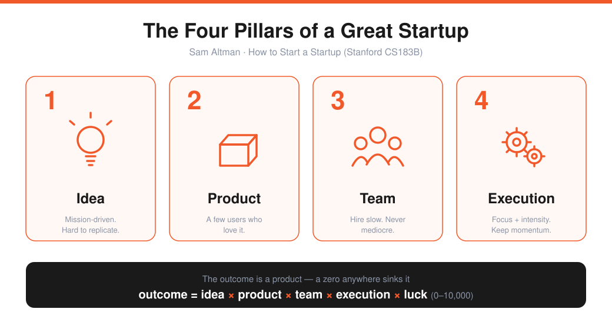
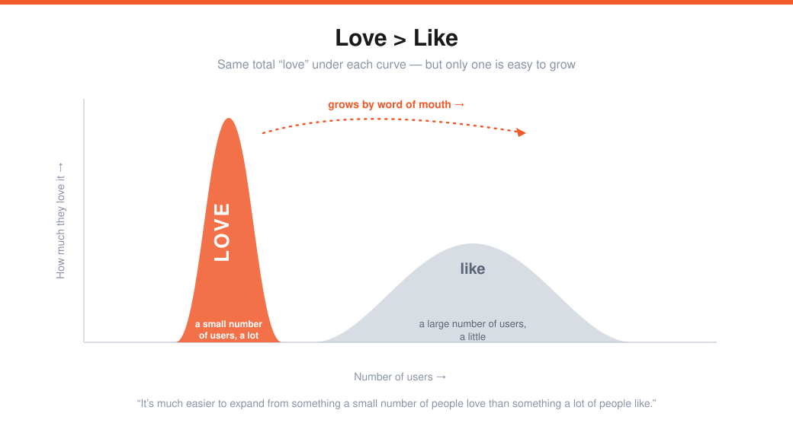
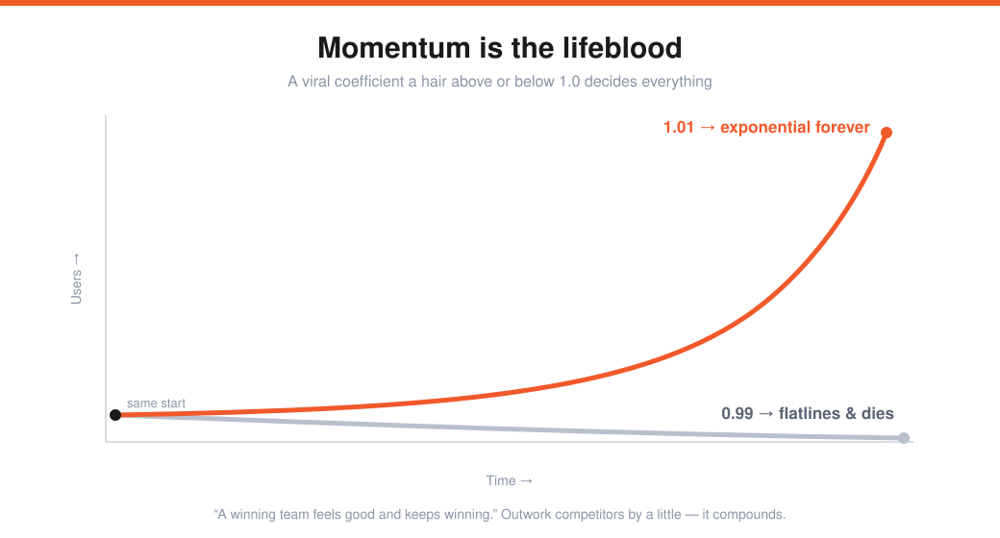
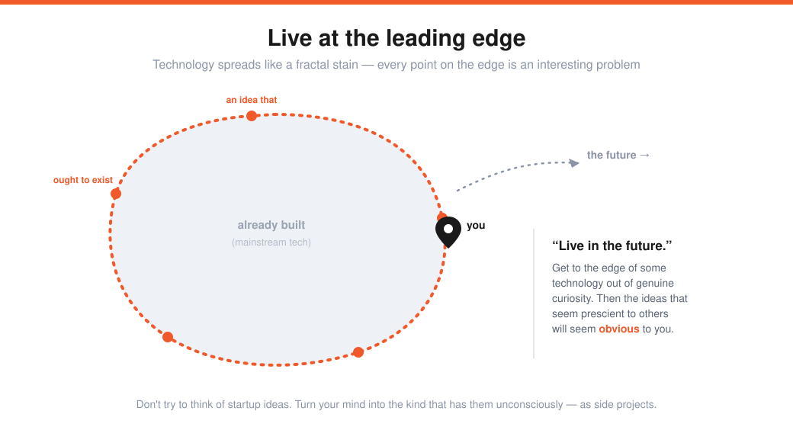
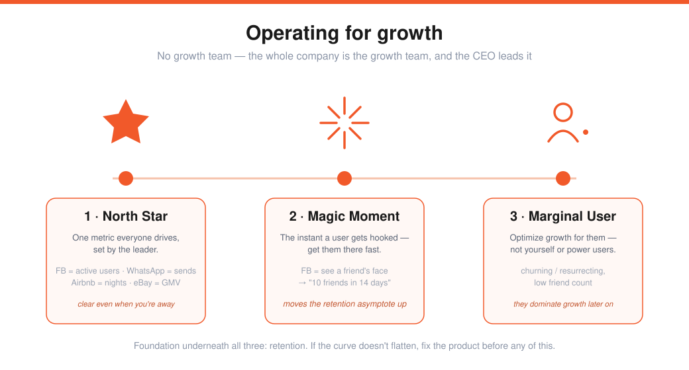
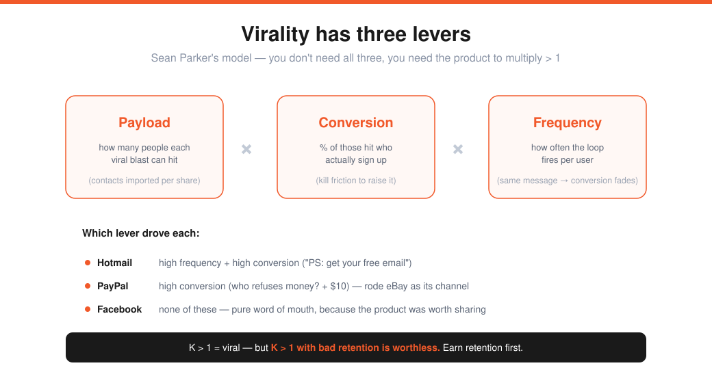
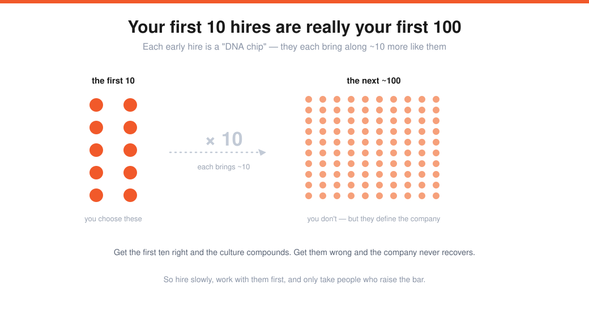
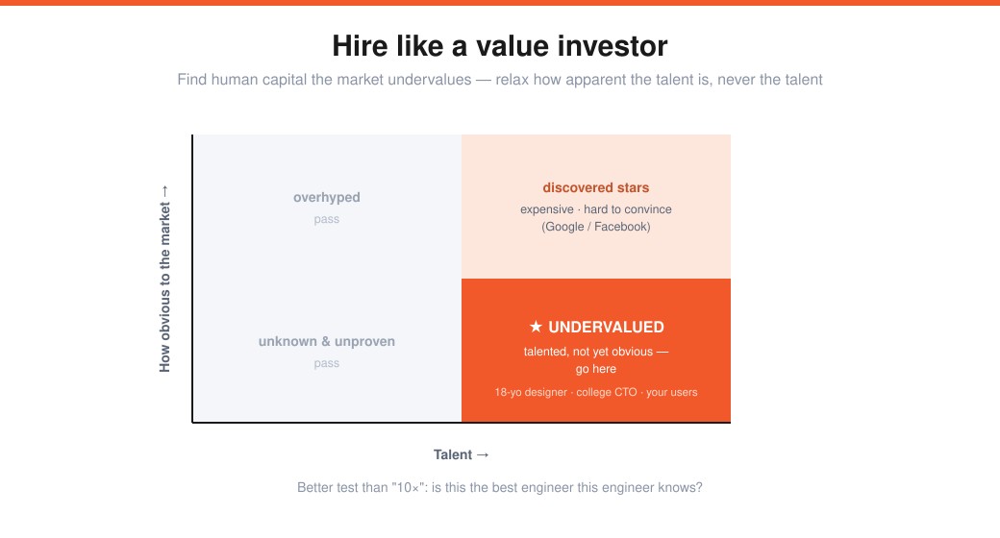

# 🚀 Startup Notes

A personal, source-faithful notebook on building a startup. Each note distills one talk, essay, or lecture down to what's *actionable* — real quotes, scannable tables, and a checklist I can run against my own company.

## Notes

| # | Note | Source | One-line |
|---|------|--------|----------|
| 01 | [The Four Pillars](01-four-pillars-sam-altman.md) | Sam Altman — *How to Start a Startup*, Lecture 1 | Idea & Product, deep. Why to start at all. |
| 02 | [Teams & Execution](02-teams-and-execution.md) | Sam Altman — Lecture 2 | Cofounders, hiring, equity, focus, momentum. |
| 03 | [Counterintuitive Startups & How to Have Ideas](03-counterintuitive-and-ideas-paul-graham.md) | Paul Graham — Lecture 3 | Suppress your instincts; "just learn"; ideas come as side projects. |
| 04 | [Building Product, Talking to Users & Growing](04-product-users-growth-adora-cheung.md) | Adora Cheung — Lecture 4 | Zero→many users: immerse, talk to users, retention, the 3 growth types. |
| 05 | [Business Strategy & Monopoly Theory](05-monopoly-theory-peter-thiel.md) | Peter Thiel — Lecture 5 | Competition is for losers; value = X×Y; build a durable monopoly. |
| 06 | [Growth](06-growth-alex-schultz.md) | Alex Schultz — Lecture 6 | Retention is everything; North Star · magic moment · marginal user; virality & tactics. |
| 07 | [Building Products Users Love, Part I](07-products-users-love-kevin-hale.md) | Kevin Hale — Lecture 7 | New users = dating, existing = marriage; support-driven dev; the knowledge gap. |
| 08 | [Doing Things That Don't Scale, PR & How to Get Started](08-dont-scale-and-pr.md) | Tang · Williams · Kan — Lecture 8 | One-hour experiments, the first-users boulder, champions, and how press really works. |
| 09 | [How to Raise Money](09-how-to-raise-money.md) | Andreessen · Conway · Conrad — Lecture 9 | Outlier math, the onion theory of risk, terms, and choosing investors like a marriage. |
| 10 | [Company Culture & Building a Team, Part I](10-culture-and-team-part-i.md) | Lin · Chesky — Lecture 10 | Designing core values, the five dysfunctions, hiring on values, culture = brand. |
| 11 | [Company Culture & Building a Team, Part II](11-culture-and-team-part-ii.md) | Collison · Collison · Silbermann — Lecture 11 | Hiring the first ten, value-investor talent, references, onboarding, scaling transparency. |

> Notes 01–02 cover Sam Altman's complete **idea × product × team × execution × luck** framework. Note 03 (Paul Graham) is the mindset layer — *when* to start and *how ideas arrive.* Note 04 (Adora Cheung) is the tactical playbook — *zero to many users.* Note 05 (Peter Thiel) is the strategy layer — *why to aim for monopoly and how it lasts.* Note 06 (Alex Schultz) is the growth engine — *retention first, then operate for growth.* Note 07 (Kevin Hale) is the love layer — *make users love the product and never stonewall them.* Note 08 (Tang · Williams · Kan) is the hustle layer — *do things that don't scale, and treat press as a tool.* Note 09 (Andreessen · Conway · Conrad) is the capital layer — *be so good they can't ignore you, and peel risk round by round.* Note 10 (Lin · Chesky) is the culture layer — *design your values and hire for them, because culture becomes brand.* Note 11 (Collisons · Silbermann) is the team-building layer — *the first ten hires are really your first hundred.*

## The big ideas at a glance

| Pillar | The one thing to remember |
|--------|---------------------------|
| **Idea** | Mission-driven, hard to copy, big market *in 10 years*. The best ideas look bad at first. |
| **Product** | A small number of users who **love** it beats a large number who like it. |
| **Team** | Hire slowly, never mediocre, be generous with employee equity. Cofounders: tough + calm, vesting from day one. |
| **Execution** | Pick the 2–3 things that matter, say no to the rest, and **never lose momentum**. |

## How this folder works

- **One note per source.** Numbered (`01-`, `02-`, …) so reading order is preserved.
- **Faithful to the source.** Quotes are real; where a source doesn't cover something, the note says so instead of inventing it.
- **`[[wiki-links]]`** connect related notes (e.g. `[[02-teams-and-execution]]`).
- **`assets/`** holds the SVG diagrams, embedded into the notes and rendered inline by GitHub.
- Every note ends with **action items** — questions to ask about *my* startup.

## Diagrams

| | |
|---|---|
|  |  |
| **Four pillars** — the framework | **Love &gt; Like** — concentrate the love |
|  |  |
| **Momentum** — a tiny edge compounds | **Leading edge** — live in the future |
|  |  |
| **Retention** — flatten into a core | **Honesty curve** — paid feedback is honest |
|  |  |
| **Value = X×Y** — capture beats size | **Concentric** — start small, expand |
|  |  |
| **Operate for growth** — star · moment · margin | **Virality** — payload × conversion × frequency |
|  |  |
| **Dating → marriage** — love at human scale | **Knowledge gap** — lower it, don't add features |
|  |  |
| **First-users boulder** — hardest at the start | **Press funnel** — story types + the process |
|  |  |
| **Onion of risk** — peel a layer each round | **Outlier math** — 15 companies, 97% of returns |
|  |  |
| **Five dysfunctions** — build up from trust | **Culture = brand** — two sides of one coin |
|  |  |
| **First 10 = 100** — the DNA multiplier | **Value-investor hiring** — find undervalued talent |

## Backlog

- [x] ~~Lecture 3 — *Counterintuitive Parts of Startups, and How to Have Ideas* (Paul Graham)~~ → [note 03](03-counterintuitive-and-ideas-paul-graham.md)
- [x] ~~Lecture 4 — *Building Product, Talking to Users, and Growing* (Adora Cheung)~~ → [note 04](04-product-users-growth-adora-cheung.md)
- [x] ~~Lecture 5 — *Business Strategy and Monopoly Theory* (Peter Thiel)~~ → [note 05](05-monopoly-theory-peter-thiel.md)
- [x] ~~Lecture 6 — *Growth* (Alex Schultz)~~ → [note 06](06-growth-alex-schultz.md)
- [x] ~~Lecture 7 — *How to Build Products Users Love, Part I* (Kevin Hale)~~ → [note 07](07-products-users-love-kevin-hale.md)
- [x] ~~Lecture 8 — *Doing Things That Don't Scale, PR, and How to Get Started* (Tang · Williams · Kan)~~ → [note 08](08-dont-scale-and-pr.md)
- [x] ~~Lecture 9 — *How to Raise Money* (Andreessen · Conway · Conrad)~~ → [note 09](09-how-to-raise-money.md)
- [x] ~~Lecture 10 — *Company Culture and Building a Team, Part I* (Lin · Chesky)~~ → [note 10](10-culture-and-team-part-i.md)
- [x] ~~Lecture 11 — *Company Culture and Building a Team, Part II* (Collisons · Silbermann)~~ → [note 11](11-culture-and-team-part-ii.md)
- [ ] Lecture 12 — *Building for the Enterprise* (Aaron Levie)
- [ ] Lecture 13 — *How to Be a Great Founder* (Reid Hoffman)
